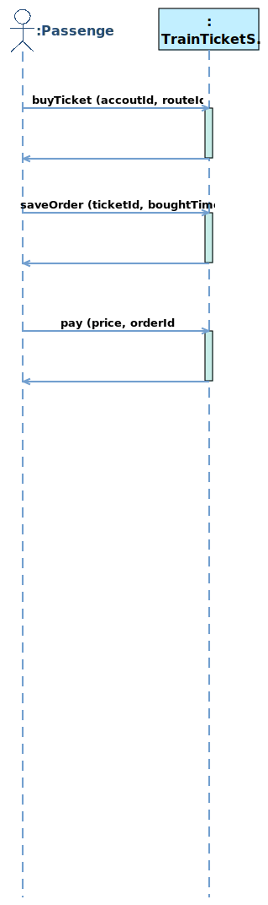
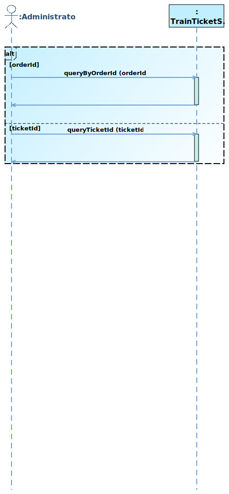
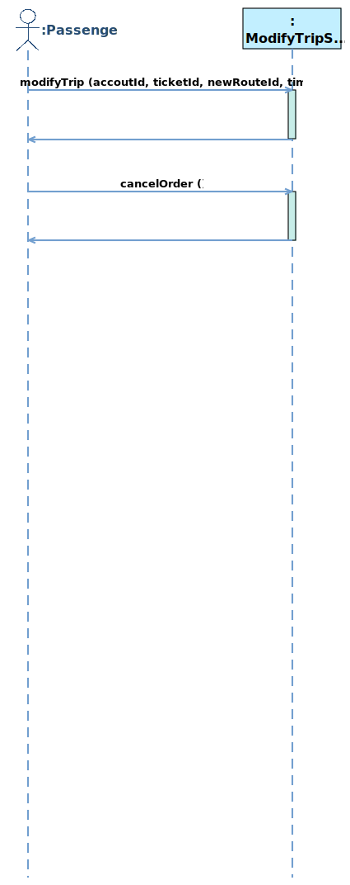
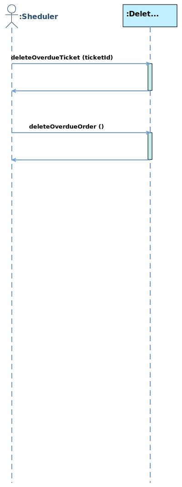

# 1   Introduction
## 1.1   Purpose
This subsection should

- a) Delineate the purpose of the SRS;
- b) Specify the intended audience for the SRS.
## 1.2   Scope
Name of software to be developed: TrainTicket System

This subsection should

- b) Explain what the software product(s) will, and, if necessary, will not do;
- c) Describe the application of the software being specifified, including relevant benefifits, objectives, and goals;
- d) Be consistent with similar statements in higher-level specififications (e.g., the system requirements specifification), if they exist.
## 1.3   Product Overview

### 1.3.1  Product perspective
This subsection of the SRS should put the product into perspective with other related products. If the product is independent and totally self-contained, it should be so stated here. If the SRS defines a product that is a component of a larger system, as frequently occurs, then this subsection should relate the requirements of that larger system to functionality of the software and should identify interfaces between that system and the software.
 
This subsection should also describe how the software operates inside various constraints. For example,
these constraints could include
- a) System interfaces;
- b) User interfaces;
- c) Hardware interfaces;
- d) Software interfaces;
- e) Communications interfaces;
- f) Memory;
- j) Operations;
- k) Site adaptation requirements.
#### 1.3.1.1   System interfaces
<b>SI1 - TrainTicketSystem</b>
<table>
	<tr>
		<td><b>Service Name:</b></td>
		<td><span name ="SERVICETrainTicketSystem">TrainTicketSystem</span></td>
	</tr>
	<tr>
		<td><b>Service ID:</b></td>
		<td>SI1</td>
	</tr>
	<tr>
		<td><b>Description:</b></td>
		<td></td>
	</tr>
	<tr>
		<td><b>Operation:</b></td>
	<td><ul><li><a href="#OPqueryInformation">queryInformation</a></li><li><a href="#OPcancelTrip">cancelTrip</a></li></ul></td>
	</tr>
	</table>
	 
<b>SI2 - ThirdPartyServices</b>
<table>
	<tr>
		<td><b>Service Name:</b></td>
		<td><span name ="SERVICEThirdPartyServices">ThirdPartyServices</span></td>
	</tr>
	<tr>
		<td><b>Service ID:</b></td>
		<td>SI2</td>
	</tr>
	<tr>
		<td><b>Description:</b></td>
		<td></td>
	</tr>
	<tr>
		<td><b>Operation:</b></td>
	<td><ul><li><a href="#OPsendNotification">sendNotification</a></li></ul></td>
	</tr>
	</table>
	 
<b>SI3 - BuyTicketService</b>
<table>
	<tr>
		<td><b>Service Name:</b></td>
		<td><span name ="SERVICEBuyTicketService">BuyTicketService</span></td>
	</tr>
	<tr>
		<td><b>Service ID:</b></td>
		<td>SI3</td>
	</tr>
	<tr>
		<td><b>Description:</b></td>
		<td></td>
	</tr>
	<tr>
		<td><b>Operation:</b></td>
	<td><ul><li><a href="#OPbuyTicket">buyTicket</a></li><li><a href="#OPsaveOrder">saveOrder</a></li><li><a href="#OPshowSeats">showSeats</a></li><li><a href="#OPselectSeat">selectSeat</a></li><li><a href="#OPpay">pay</a></li></ul></td>
	</tr>
<tr>
			<td><b>Temporary Variable</b></td>
			<td><b>Variable Description</b></td>
	</tr>
	<tr>
		<td><span name ="BuyTicketServiceCurrentOrder">CurrentOrder</span></td>
		<td>CurrentOrder is a object of <a href="#CLASSOrder">Order</a></td>
					</tr>
	<tr>
		<td><span name ="BuyTicketServiceCurrentAccout">CurrentAccout</span></td>
		<td>CurrentAccout is a object of <a href="#CLASSAccout">Accout</a></td>
					</tr>
	<tr>
		<td><span name ="BuyTicketServiceCurrentTicket">CurrentTicket</span></td>
		<td>CurrentTicket is a object of <a href="#CLASSTicket">Ticket</a></td>
					</tr>
	<tr>
		<td><span name ="BuyTicketServiceCurrentRoute">CurrentRoute</span></td>
		<td>CurrentRoute is a object of <a href="#CLASSRoute">Route</a></td>
					</tr>
	</table>
	 
<b>SI4 - QueryOrderService</b>
<table>
	<tr>
		<td><b>Service Name:</b></td>
		<td><span name ="SERVICEQueryOrderService">QueryOrderService</span></td>
	</tr>
	<tr>
		<td><b>Service ID:</b></td>
		<td>SI4</td>
	</tr>
	<tr>
		<td><b>Description:</b></td>
		<td></td>
	</tr>
	<tr>
		<td><b>Operation:</b></td>
	<td><ul><li><a href="#OPqueryByAccoutId">queryByAccoutId</a></li><li><a href="#OPqueryTicketId">queryTicketId</a></li></ul></td>
	</tr>
<tr>
			<td><b>Temporary Variable</b></td>
			<td><b>Variable Description</b></td>
	</tr>
	<tr>
		<td><span name ="QueryOrderServiceCurrentQueryMethod">CurrentQueryMethod</span></td>
		<td>CurrentQueryMethod has several options: [ACCOUT|TICKET]</td>
					</tr>
	</table>
	 
<b>SI5 - ManageRouteCRUDService</b>
<table>
	<tr>
		<td><b>Service Name:</b></td>
		<td><span name ="SERVICEManageRouteCRUDService">ManageRouteCRUDService</span></td>
	</tr>
	<tr>
		<td><b>Service ID:</b></td>
		<td>SI5</td>
	</tr>
	<tr>
		<td><b>Description:</b></td>
		<td></td>
	</tr>
	<tr>
		<td><b>Operation:</b></td>
	<td><ul><li><a href="#OPcreateRoute">createRoute</a></li><li><a href="#OPqueryRoute">queryRoute</a></li><li><a href="#OPmodifyRoute">modifyRoute</a></li><li><a href="#OPdeleteRoute">deleteRoute</a></li></ul></td>
	</tr>
	</table>
	 
<b>SI6 - ManageTrainCRUDService</b>
<table>
	<tr>
		<td><b>Service Name:</b></td>
		<td><span name ="SERVICEManageTrainCRUDService">ManageTrainCRUDService</span></td>
	</tr>
	<tr>
		<td><b>Service ID:</b></td>
		<td>SI6</td>
	</tr>
	<tr>
		<td><b>Description:</b></td>
		<td></td>
	</tr>
	<tr>
		<td><b>Operation:</b></td>
	<td><ul><li><a href="#OPcreateTrain">createTrain</a></li><li><a href="#OPqueryTrain">queryTrain</a></li><li><a href="#OPmodifyTrain">modifyTrain</a></li><li><a href="#OPdeleteTrain">deleteTrain</a></li></ul></td>
	</tr>
	</table>
	 
<b>SI7 - ManageTicketCRUDService</b>
<table>
	<tr>
		<td><b>Service Name:</b></td>
		<td><span name ="SERVICEManageTicketCRUDService">ManageTicketCRUDService</span></td>
	</tr>
	<tr>
		<td><b>Service ID:</b></td>
		<td>SI7</td>
	</tr>
	<tr>
		<td><b>Description:</b></td>
		<td></td>
	</tr>
	<tr>
		<td><b>Operation:</b></td>
	<td><ul><li><a href="#OPcreateTicket">createTicket</a></li><li><a href="#OPqueryTicket">queryTicket</a></li><li><a href="#OPmodifyTicket">modifyTicket</a></li><li><a href="#OPdeleteTicket">deleteTicket</a></li></ul></td>
	</tr>
	</table>
	 
<b>SI8 - ManageOrderCRUDService</b>
<table>
	<tr>
		<td><b>Service Name:</b></td>
		<td><span name ="SERVICEManageOrderCRUDService">ManageOrderCRUDService</span></td>
	</tr>
	<tr>
		<td><b>Service ID:</b></td>
		<td>SI8</td>
	</tr>
	<tr>
		<td><b>Description:</b></td>
		<td></td>
	</tr>
	<tr>
		<td><b>Operation:</b></td>
	<td><ul><li><a href="#OPcreateOrder">createOrder</a></li><li><a href="#OPqueryOrder">queryOrder</a></li><li><a href="#OPmodifyOrder">modifyOrder</a></li><li><a href="#OPdeleteOrder">deleteOrder</a></li></ul></td>
	</tr>
	</table>
	 
<b>SI9 - ManageAccoutCRUDService</b>
<table>
	<tr>
		<td><b>Service Name:</b></td>
		<td><span name ="SERVICEManageAccoutCRUDService">ManageAccoutCRUDService</span></td>
	</tr>
	<tr>
		<td><b>Service ID:</b></td>
		<td>SI9</td>
	</tr>
	<tr>
		<td><b>Description:</b></td>
		<td></td>
	</tr>
	<tr>
		<td><b>Operation:</b></td>
	<td><ul><li><a href="#OPcreateAccout">createAccout</a></li><li><a href="#OPqueryAccout">queryAccout</a></li><li><a href="#OPmodifyAccout">modifyAccout</a></li><li><a href="#OPdeleteAccout">deleteAccout</a></li></ul></td>
	</tr>
	</table>
	 
<b>SI10 - ManageSeatCRUDService</b>
<table>
	<tr>
		<td><b>Service Name:</b></td>
		<td><span name ="SERVICEManageSeatCRUDService">ManageSeatCRUDService</span></td>
	</tr>
	<tr>
		<td><b>Service ID:</b></td>
		<td>SI10</td>
	</tr>
	<tr>
		<td><b>Description:</b></td>
		<td></td>
	</tr>
	<tr>
		<td><b>Operation:</b></td>
	<td><ul><li><a href="#OPcreateSeat">createSeat</a></li><li><a href="#OPquerySeat">querySeat</a></li><li><a href="#OPmodifySeat">modifySeat</a></li><li><a href="#OPdeleteSeat">deleteSeat</a></li></ul></td>
	</tr>
	</table>
	 
<b>SI11 - ModifyTripService</b>
<table>
	<tr>
		<td><b>Service Name:</b></td>
		<td><span name ="SERVICEModifyTripService">ModifyTripService</span></td>
	</tr>
	<tr>
		<td><b>Service ID:</b></td>
		<td>SI11</td>
	</tr>
	<tr>
		<td><b>Description:</b></td>
		<td></td>
	</tr>
	<tr>
		<td><b>Operation:</b></td>
	<td><ul><li><a href="#OPupdateTicket">updateTicket</a></li><li><a href="#OPupdateOrder">updateOrder</a></li><li><a href="#OPshowSeatsByRouteId">showSeatsByRouteId</a></li><li><a href="#OPselectNewSeat">selectNewSeat</a></li><li><a href="#OPpayDifference">payDifference</a></li></ul></td>
	</tr>
<tr>
			<td><b>Temporary Variable</b></td>
			<td><b>Variable Description</b></td>
	</tr>
	<tr>
		<td><span name ="ModifyTripServiceCurrentOrder">CurrentOrder</span></td>
		<td>CurrentOrder is a object of <a href="#CLASSOrder">Order</a></td>
					</tr>
	<tr>
		<td><span name ="ModifyTripServiceCurrentTicket">CurrentTicket</span></td>
		<td>CurrentTicket is a object of <a href="#CLASSTicket">Ticket</a></td>
					</tr>
	<tr>
		<td><span name ="ModifyTripServiceCurrentAccout">CurrentAccout</span></td>
		<td>CurrentAccout is a object of <a href="#CLASSAccout">Accout</a></td>
					</tr>
	<tr>
		<td><span name ="ModifyTripServiceCurrentRoute">CurrentRoute</span></td>
		<td>CurrentRoute is a object of <a href="#CLASSRoute">Route</a></td>
					</tr>
	</table>
	 
<b>SI12 - DeleteOverdueOrderService</b>
<table>
	<tr>
		<td><b>Service Name:</b></td>
		<td><span name ="SERVICEDeleteOverdueOrderService">DeleteOverdueOrderService</span></td>
	</tr>
	<tr>
		<td><b>Service ID:</b></td>
		<td>SI12</td>
	</tr>
	<tr>
		<td><b>Description:</b></td>
		<td></td>
	</tr>
	<tr>
		<td><b>Operation:</b></td>
	<td><ul><li><a href="#OPdeleteOverdueTicket">deleteOverdueTicket</a></li><li><a href="#OPdeleteOverdueOrder">deleteOverdueOrder</a></li></ul></td>
	</tr>
<tr>
			<td><b>Temporary Variable</b></td>
			<td><b>Variable Description</b></td>
	</tr>
	<tr>
		<td><span name ="DeleteOverdueOrderServiceCurrentTicketId">CurrentTicketId</span></td>
		<td>the type of CurrentTicketId is String</td>
					</tr>
	</table>
	 
 
### 1.3.2  Product functions
<b>Use Case Diagram</b>
 

 
<table>
	<tr>
		<td><b>ID</b></td>
		<td><b>Use Case Name</b></td>
		<td><b>Use Case Description</b></td>
		<td><b>Subfunction</b></td>
	</tr>
	<tr>
		<td>UC1</td>
		<td><a href="#UCbuyTicket">buyTicket</a></td>
		<td></td>
		<td>
		<p><a href="#OPbuyTicket">buyTicket</a></p><p><a href="#OPsaveOrder">saveOrder</a></p><p><a href="#OPshowSeats">showSeats</a></p><p><a href="#OPselectSeat">selectSeat</a></p><p><a href="#OPpay">pay</a></p>
		</td>
	</tr>
	<tr>
		<td>UC2</td>
		<td><a href="#UCqueryInformation">queryInformation</a></td>
		<td></td>
		<td>
		</td>
	</tr>
	<tr>
		<td>UC3</td>
		<td><a href="#UCcancelTrip">cancelTrip</a></td>
		<td></td>
		<td>
		</td>
	</tr>
	<tr>
		<td>UC4</td>
		<td><a href="#UCsendNotification">sendNotification</a></td>
		<td></td>
		<td>
		</td>
	</tr>
	<tr>
		<td>UC5</td>
		<td><a href="#UCmanageRoute">manageRoute</a></td>
		<td></td>
		<td>
		<p><a href="#OPcreateRoute">createRoute</a></p><p><a href="#OPqueryRoute">queryRoute</a></p><p><a href="#OPmodifyRoute">modifyRoute</a></p><p><a href="#OPdeleteRoute">deleteRoute</a></p>
		</td>
	</tr>
	<tr>
		<td>UC6</td>
		<td><a href="#UCmanageTrain">manageTrain</a></td>
		<td></td>
		<td>
		<p><a href="#OPcreateTrain">createTrain</a></p><p><a href="#OPqueryTrain">queryTrain</a></p><p><a href="#OPmodifyTrain">modifyTrain</a></p><p><a href="#OPdeleteTrain">deleteTrain</a></p>
		</td>
	</tr>
	<tr>
		<td>UC7</td>
		<td><a href="#UCmanageSeat">manageSeat</a></td>
		<td></td>
		<td>
		<p><a href="#OPcreateSeat">createSeat</a></p><p><a href="#OPquerySeat">querySeat</a></p><p><a href="#OPmodifySeat">modifySeat</a></p><p><a href="#OPdeleteSeat">deleteSeat</a></p>
		</td>
	</tr>
	<tr>
		<td>UC8</td>
		<td><a href="#UCqueryOrder">queryOrder</a></td>
		<td></td>
		<td>
		<p><a href="#OPqueryByAccoutId">queryByAccoutId</a></p><p><a href="#OPqueryTicketId">queryTicketId</a></p>
		</td>
	</tr>
	<tr>
		<td>UC9</td>
		<td><a href="#UCmanageAccout">manageAccout</a></td>
		<td></td>
		<td>
		<p><a href="#OPcreateAccout">createAccout</a></p><p><a href="#OPqueryAccout">queryAccout</a></p><p><a href="#OPmodifyAccout">modifyAccout</a></p><p><a href="#OPdeleteAccout">deleteAccout</a></p>
		</td>
	</tr>
	<tr>
		<td>UC10</td>
		<td><a href="#UCmodifyTrip">modifyTrip</a></td>
		<td></td>
		<td>
		<p><a href="#OPupdateTicket">updateTicket</a></p><p><a href="#OPupdateOrder">updateOrder</a></p><p><a href="#OPshowSeatsByRouteId">showSeatsByRouteId</a></p><p><a href="#OPselectNewSeat">selectNewSeat</a></p><p><a href="#OPpayDifference">payDifference</a></p>
		</td>
	</tr>
	<tr>
		<td>UC11</td>
		<td><a href="#UCdeleteOverdueOrder">deleteOverdueOrder</a></td>
		<td></td>
		<td>
		<p><a href="#OPdeleteOverdueTicket">deleteOverdueTicket</a></p><p><a href="#OPdeleteOverdueOrder">deleteOverdueOrder</a></p>
		</td>
	</tr>
</table>
### 1.3.3  User characteristics

<table>
	<tr>
		<td><b>ID</b></td>
		<td><b>Actor</b></td>
		<td><b>Description</b></td>
		<td><b>Super Actor</b></td>
	</tr>
	<tr>
		<td>A1</td>
		<td><span name ="ACTORPassenger">Passenger</span></td>
		<td></td>
		<td></td>
	</tr><tr>
		<td>A2</td>
		<td><span name ="ACTORThirdSystem">ThirdSystem</span></td>
		<td></td>
		<td></td>
	</tr><tr>
		<td>A3</td>
		<td><span name ="ACTORStaff">Staff</span></td>
		<td></td>
		<td></td>
	</tr><tr>
		<td>A4</td>
		<td><span name ="ACTORAdministrator">Administrator</span></td>
		<td></td>
		<td></td>
	</tr>
</table>

### 1.3.4 Limitations
This subsection of the SRS should provide a general description of any other items that will limit the developer’s options. These include

- a) Regulatory policies;
- b) Hardware limitations (e.g., signal timing requirements);
- c) Interfaces to other applications;
- d) Parallel operation;
- e) Audit functions;
- f) Control functions;
- g) Higher-order language requirements;
- h) Signal handshake protocols (e.g., XON-XOFF, ACK-NACK);
- i) Reliability requirements;
- j) Criticality of the application;
- k) Safety and security considerations.
- l) physical/mental considerations; and
- m) limitations that are sourced from other systems, including real-time requirements from the controlled system through interfaces.

## 1.4   Definitions
This subsection should provide the defifinitions of all terms required to properly interpret the SRS. This information may be provided by reference to one or more appendixes in the SRS or by reference to other documents.

# 2  References
This subsection should

- a) Provide a complete list of all documents referenced elsewhere in the SRS;
- b) Identify each document by title, report number (if applicable), date, and publishing organization;
- c) Specify the sources from which the references can be obtained.

This information may be provided by reference to an appendix or to another document.

# 3  Requirements
## 3.1  Functions
### 3.1.1   Use Case
<b>UC1 - buyTicket</b>
<p>System Sequence Diagram:</p>
 

 
<p>Use Case Description:</p>
 
<table>
	<tr>
		<td><b>UseCase Name:</b></td>
		<td><span name ="UCbuyTicket">buyTicket</span></td>
	</tr>
	<tr>
		<td><b>UseCase ID:</b></td>
		<td>UC1</td>
	</tr>
	<tr>
		<td><b>Brief Description:</b></td>
		<td></td>
	</tr>
	<tr>
		<td><b>Involved Actor:</b></td>
	<td><a href="#ACTORPassenger">Passenger</a></td>
	</tr>
	<tr>
		<td><b>Preconditions:</b></td>
		<td><ol></ol></td>
	</tr>
	<tr>
		<td><b>Postconditions:</b></td>
		<td><ol></ol></td>
	</tr>						
	<tr>
		<td><b>Basic Path:</b></td>
	<td><p>1. Passenger clicks to execute the operation <a href="#OPbuyTicket">buyTicket</a>, with entering accoutId, routeId, ticketId</p><p>2. Passenger clicks to execute the operation <a href="#OPsaveOrder">saveOrder</a>, with entering orderId, boughtTime</p><p>3. Passenger clicks to execute the operation <a href="#OPpay">pay</a>, with entering price</p></td>
	</tr>
	<tr>
		<td><b>Alternative Path:</b></td>
		<td></td>
	</tr>
	</table>

<b>UC2 - queryInformation</b>
 
<p>Use Case Description:</p>
 
<table>
	<tr>
		<td><b>UseCase Name:</b></td>
		<td><span name ="UCqueryInformation">queryInformation</span></td>
	</tr>
	<tr>
		<td><b>UseCase ID:</b></td>
		<td>UC2</td>
	</tr>
	<tr>
		<td><b>Brief Description:</b></td>
		<td></td>
	</tr>
	<tr>
		<td><b>Involved Actor:</b></td>
	<td><a href="#ACTORPassenger">Passenger</a></td>
	</tr>
	<tr>
		<td><b>Preconditions:</b></td>
		<td><ol></ol></td>
	</tr>
	<tr>
		<td><b>Postconditions:</b></td>
		<td><ol></ol></td>
	</tr>						
	<tr>
		<td><b>Basic Path:</b></td>
	<td></td>
	</tr>
	<tr>
		<td><b>Alternative Path:</b></td>
		<td></td>
	</tr>
	</table>

<b>UC3 - cancelTrip</b>
 
<p>Use Case Description:</p>
 
<table>
	<tr>
		<td><b>UseCase Name:</b></td>
		<td><span name ="UCcancelTrip">cancelTrip</span></td>
	</tr>
	<tr>
		<td><b>UseCase ID:</b></td>
		<td>UC3</td>
	</tr>
	<tr>
		<td><b>Brief Description:</b></td>
		<td></td>
	</tr>
	<tr>
		<td><b>Involved Actor:</b></td>
	<td><a href="#ACTORPassenger">Passenger</a></td>
	</tr>
	<tr>
		<td><b>Preconditions:</b></td>
		<td><ol></ol></td>
	</tr>
	<tr>
		<td><b>Postconditions:</b></td>
		<td><ol></ol></td>
	</tr>						
	<tr>
		<td><b>Basic Path:</b></td>
	<td></td>
	</tr>
	<tr>
		<td><b>Alternative Path:</b></td>
		<td></td>
	</tr>
	</table>

<b>UC4 - sendNotification</b>
 
<p>Use Case Description:</p>
 
<table>
	<tr>
		<td><b>UseCase Name:</b></td>
		<td><span name ="UCsendNotification">sendNotification</span></td>
	</tr>
	<tr>
		<td><b>UseCase ID:</b></td>
		<td>UC4</td>
	</tr>
	<tr>
		<td><b>Brief Description:</b></td>
		<td></td>
	</tr>
	<tr>
		<td><b>Involved Actor:</b></td>
	<td><a href="#ACTORThirdSystem">ThirdSystem</a></td>
	</tr>
	<tr>
		<td><b>Preconditions:</b></td>
		<td><ol></ol></td>
	</tr>
	<tr>
		<td><b>Postconditions:</b></td>
		<td><ol></ol></td>
	</tr>						
	<tr>
		<td><b>Basic Path:</b></td>
	<td></td>
	</tr>
	<tr>
		<td><b>Alternative Path:</b></td>
		<td></td>
	</tr>
	</table>

<b>UC5 - manageRoute</b>
 
<p>Use Case Description:</p>
 
<table>
	<tr>
		<td><b>UseCase Name:</b></td>
		<td><span name ="UCmanageRoute">manageRoute</span></td>
	</tr>
	<tr>
		<td><b>UseCase ID:</b></td>
		<td>UC5</td>
	</tr>
	<tr>
		<td><b>Brief Description:</b></td>
		<td></td>
	</tr>
	<tr>
		<td><b>Involved Actor:</b></td>
	<td><a href="#ACTORStaff">Staff</a></td>
	</tr>
	<tr>
		<td><b>Preconditions:</b></td>
		<td><ol></ol></td>
	</tr>
	<tr>
		<td><b>Postconditions:</b></td>
		<td><ol></ol></td>
	</tr>						
	<tr>
		<td><b>Basic Path:</b></td>
	<td></td>
	</tr>
	<tr>
		<td><b>Alternative Path:</b></td>
		<td></td>
	</tr>
	</table>

<b>UC6 - manageTrain</b>
 
<p>Use Case Description:</p>
 
<table>
	<tr>
		<td><b>UseCase Name:</b></td>
		<td><span name ="UCmanageTrain">manageTrain</span></td>
	</tr>
	<tr>
		<td><b>UseCase ID:</b></td>
		<td>UC6</td>
	</tr>
	<tr>
		<td><b>Brief Description:</b></td>
		<td></td>
	</tr>
	<tr>
		<td><b>Involved Actor:</b></td>
	<td><a href="#ACTORStaff">Staff</a></td>
	</tr>
	<tr>
		<td><b>Preconditions:</b></td>
		<td><ol></ol></td>
	</tr>
	<tr>
		<td><b>Postconditions:</b></td>
		<td><ol></ol></td>
	</tr>						
	<tr>
		<td><b>Basic Path:</b></td>
	<td></td>
	</tr>
	<tr>
		<td><b>Alternative Path:</b></td>
		<td></td>
	</tr>
	</table>

<b>UC7 - manageSeat</b>
 
<p>Use Case Description:</p>
 
<table>
	<tr>
		<td><b>UseCase Name:</b></td>
		<td><span name ="UCmanageSeat">manageSeat</span></td>
	</tr>
	<tr>
		<td><b>UseCase ID:</b></td>
		<td>UC7</td>
	</tr>
	<tr>
		<td><b>Brief Description:</b></td>
		<td></td>
	</tr>
	<tr>
		<td><b>Involved Actor:</b></td>
	<td><a href="#ACTORStaff">Staff</a></td>
	</tr>
	<tr>
		<td><b>Preconditions:</b></td>
		<td><ol></ol></td>
	</tr>
	<tr>
		<td><b>Postconditions:</b></td>
		<td><ol></ol></td>
	</tr>						
	<tr>
		<td><b>Basic Path:</b></td>
	<td></td>
	</tr>
	<tr>
		<td><b>Alternative Path:</b></td>
		<td></td>
	</tr>
	</table>

<b>UC8 - queryOrder</b>
<p>System Sequence Diagram:</p>
 

 
<p>Use Case Description:</p>
 
<table>
	<tr>
		<td><b>UseCase Name:</b></td>
		<td><span name ="UCqueryOrder">queryOrder</span></td>
	</tr>
	<tr>
		<td><b>UseCase ID:</b></td>
		<td>UC8</td>
	</tr>
	<tr>
		<td><b>Brief Description:</b></td>
		<td></td>
	</tr>
	<tr>
		<td><b>Involved Actor:</b></td>
	<td><a href="#ACTORAdministrator">Administrator</a></td>
	</tr>
	<tr>
		<td><b>Preconditions:</b></td>
		<td><ol></ol></td>
	</tr>
	<tr>
		<td><b>Postconditions:</b></td>
		<td><ol></ol></td>
	</tr>						
	<tr>
		<td><b>Basic Path:</b></td>
	<td><p>1. Administrator clicks to execute the operation <a href="#OPdeleteOverdueOrder">deleteOverdueOrder</a></p><p>2. Administrator clicks to execute the operation <a href="#OPdeleteOverdueTicket">deleteOverdueTicket</a>, with entering ticketId</p><p>3.  Execute  queryMethod</p><p>&emsp;Select accoutId:</p><p>&emsp;&emsp;Administrator clicks to execute the operation <a href="#OPqueryByAccoutId">queryByAccoutId</a>, with entering accoutId</p><p>&emsp;Select ticketId:</p><p>&emsp;&emsp;Administrator clicks to execute the operation <a href="#OPqueryTicketId">queryTicketId</a>, with entering ticketId</p></td>
	</tr>
	<tr>
		<td><b>Alternative Path:</b></td>
		<td></td>
	</tr>
	</table>

<b>UC9 - manageAccout</b>
 
<p>Use Case Description:</p>
 
<table>
	<tr>
		<td><b>UseCase Name:</b></td>
		<td><span name ="UCmanageAccout">manageAccout</span></td>
	</tr>
	<tr>
		<td><b>UseCase ID:</b></td>
		<td>UC9</td>
	</tr>
	<tr>
		<td><b>Brief Description:</b></td>
		<td></td>
	</tr>
	<tr>
		<td><b>Involved Actor:</b></td>
	<td><a href="#ACTORAdministrator">Administrator</a></td>
	</tr>
	<tr>
		<td><b>Preconditions:</b></td>
		<td><ol></ol></td>
	</tr>
	<tr>
		<td><b>Postconditions:</b></td>
		<td><ol></ol></td>
	</tr>						
	<tr>
		<td><b>Basic Path:</b></td>
	<td></td>
	</tr>
	<tr>
		<td><b>Alternative Path:</b></td>
		<td></td>
	</tr>
	</table>

<b>UC10 - modifyTrip</b>
<p>System Sequence Diagram:</p>
 

 
<p>Use Case Description:</p>
 
<table>
	<tr>
		<td><b>UseCase Name:</b></td>
		<td><span name ="UCmodifyTrip">modifyTrip</span></td>
	</tr>
	<tr>
		<td><b>UseCase ID:</b></td>
		<td>UC10</td>
	</tr>
	<tr>
		<td><b>Brief Description:</b></td>
		<td></td>
	</tr>
	<tr>
		<td><b>Involved Actor:</b></td>
	<td><a href="#ACTORPassenger">Passenger</a></td>
	</tr>
	<tr>
		<td><b>Preconditions:</b></td>
		<td><ol></ol></td>
	</tr>
	<tr>
		<td><b>Postconditions:</b></td>
		<td><ol></ol></td>
	</tr>						
	<tr>
		<td><b>Basic Path:</b></td>
	<td><p>1. Passenger clicks to execute the operation <a href="#OPupdateTicket">updateTicket</a>, with entering accoutId, ticketId, newRouteId</p><p>2. Passenger clicks to execute the operation <a href="#OPupdateOrder">updateOrder</a>, with entering time</p><p>3. Passenger clicks to execute the operation <a href="#OPpayDifference">payDifference</a>, with entering difference</p><p>4. Passenger clicks to execute the operation <a href="#OPupdateTicket">updateTicket</a>, with entering accoutId, ticketId, newRouteId</p><p>5. Passenger clicks to execute the operation <a href="#OPupdateOrder">updateOrder</a>, with entering time</p></td>
	</tr>
	<tr>
		<td><b>Alternative Path:</b></td>
		<td></td>
	</tr>
	</table>

<b>UC11 - deleteOverdueOrder</b>
<p>System Sequence Diagram:</p>
 

 
<p>Use Case Description:</p>
 
<table>
	<tr>
		<td><b>UseCase Name:</b></td>
		<td><span name ="UCdeleteOverdueOrder">deleteOverdueOrder</span></td>
	</tr>
	<tr>
		<td><b>UseCase ID:</b></td>
		<td>UC11</td>
	</tr>
	<tr>
		<td><b>Brief Description:</b></td>
		<td></td>
	</tr>
	<tr>
		<td><b>Involved Actor:</b></td>
	<td><a href="#ACTORAdministrator">Administrator</a></td>
	</tr>
	<tr>
		<td><b>Preconditions:</b></td>
		<td><ol></ol></td>
	</tr>
	<tr>
		<td><b>Postconditions:</b></td>
		<td><ol></ol></td>
	</tr>						
	<tr>
		<td><b>Basic Path:</b></td>
	<td><p>1. Administrator clicks to execute the operation <a href="#OPdeleteOverdueTicket">deleteOverdueTicket</a>, with entering ticketId</p><p>2. Administrator clicks to execute the operation <a href="#OPdeleteOverdueOrder">deleteOverdueOrder</a></p></td>
	</tr>
	<tr>
		<td><b>Alternative Path:</b></td>
		<td></td>
	</tr>
	</table>

 
### 3.1.2   System Operation
<b>OP1 - createRoute</b>
<table>
	<tr>
		<td><b>Operation Name:</b></td>
		<td><span name ="OPcreateRoute">createRoute</span></td>
	</tr>
	<tr>
		<td><b>Operation ID:</b></td>
		<td>OP1</td>
	</tr>
	<tr>
		<td><b>Description:</b></td>
		<td> </td>
	</tr>
	<tr>
		<td><b>Service:</b></td>
		<td><a href="#SERVICEManageRouteCRUDService">ManageRouteCRUDService</a></td>
	</tr>
	<tr>
		<td><b>Input:</b></td>
<td><p>1. name: <i>routeid</i>, type: String</p><p>2. name: <i>startstation</i>, type: String</p><p>3. name: <i>endstation</i>, type: String</p><p>4. name: <i>time</i>, type: String</p><p>5. name: <i>trainid</i>, type: String</p></td>
</tr>
<tr>
	<td><b>Output Type:</b></td>
	<td>Boolean</td>
</tr>
<tr>
			<td><b>Definition:</b></td>
<td><p>1. <i>route</i> is the object <i>rou</i> in the instance set of class <a href="#CLASSRoute">Route</a>. <i>rou</i> represents an object of class <a href="#CLASSRoute">Route</a>, and <i>rou</i> meets:</p><p>&emsp;&emsp;The attribute <i>RouteId</i> of the object <i>rou</i> is equal to <i>routeid</i></p><p>2. <i>train</i> is the object <i>tra</i> in the instance set of class <a href="#CLASSTrain">Train</a>. <i>tra</i> represents an object of class <a href="#CLASSTrain">Train</a>, and <i>tra</i> meets:</p><p>&emsp;&emsp;The attribute <i>TrainId</i> of the object <i>tra</i> is equal to <i>trainid</i></p></td>
	</tr>
	<tr>
<td><b>Preconditions:</b></td>
		<td><p>1. The object <i>route</i> doesn't exist</p><p>2. The object <i>train</i> exists</p></td>
</tr>
	<tr>
		<td><b>Postconditions:</b></td>
	<td><p>1. <i>rou</i> represented the object of class <a href="#CLASSRoute">Route</a></p><p>2. The object <i>rou</i> was created</p><p>3. The attribute <i>RouteId</i> of the object <i>rou</i> became <i>routeid</i></p><p>4. The attribute <i>StartStation</i> of the object <i>rou</i> became <i>startstation</i></p><p>5. The attribute <i>EndStation</i> of the object <i>rou</i> became <i>endstation</i></p><p>6. The attribute <i>Time</i> of the object <i>rou</i> became <i>time</i></p><p>7. The attribute <i>TrainId</i> of the object <i>rou</i> became <i>trainid</i></p><p>8. The object <i>rou</i> was put into the instance set of class <a href="#CLASSRoute">Route</a></p><p>9. The return value was <b>true</b></p></td>
	</tr>
</table>
 
<p>Contract of <b>createRoute</b>:</p>
 
```java
Contract  ManageRouteCRUDService::createRoute(routeid : String, startstation : String, endstation : String, time : String, trainid : String) : Boolean {
/*
Generated by RM2Doc - Definition
route is the object rou in the instance set of class Route. rou represents an object of class Route, and rou meets:
    The attribute RouteId of the object rou is equal to routeid
train is the object tra in the instance set of class Train. tra represents an object of class Train, and tra meets:
    The attribute TrainId of the object tra is equal to trainid
*/
		definition:
			route:Route = Route.allInstance()->any(rou:Route | rou.RouteId = routeid),
			train:Train = Train.allInstance()->any(tra:Train | tra.TrainId = trainid)
/*
Generated by RM2Doc - Precondition
The object route doesn't exist
The object train exists
*/
		precondition:
			route.oclIsUndefined() = true and
			train.oclIsUndefined() = false
/*
Generated by RM2Doc - Postcondition
rou represented the object of class Route
The object rou was created
The attribute RouteId of the object rou became routeid
The attribute StartStation of the object rou became startstation
The attribute EndStation of the object rou became endstation
The attribute Time of the object rou became time
The attribute TrainId of the object rou became trainid
The object rou was put into the instance set of class Route
The return value was true
*/
		postcondition:
			let rou:Route in
			rou.oclIsNew() and
			rou.RouteId = routeid and
			rou.StartStation = startstation and
			rou.EndStation = endstation and
			rou.Time = time and
			rou.TrainId = trainid and
			Route.allInstance()->includes(rou) and
			result = true
}
```

<b>OP2 - queryRoute</b>
<table>
	<tr>
		<td><b>Operation Name:</b></td>
		<td><span name ="OPqueryRoute">queryRoute</span></td>
	</tr>
	<tr>
		<td><b>Operation ID:</b></td>
		<td>OP2</td>
	</tr>
	<tr>
		<td><b>Description:</b></td>
		<td> </td>
	</tr>
	<tr>
		<td><b>Service:</b></td>
		<td><a href="#SERVICEManageRouteCRUDService">ManageRouteCRUDService</a></td>
	</tr>
	<tr>
		<td><b>Input:</b></td>
<td><p>name: <i>routeid</i>, type: String</p></td>
</tr>
<tr>
	<td><b>Output Type:</b></td>
	<td><a href="#CLASSRoute">Route</a></td>
</tr>
<tr>
			<td><b>Definition:</b></td>
<td><p><i>route</i> is the object <i>rou</i> in the instance set of class <a href="#CLASSRoute">Route</a>. <i>rou</i> represents an object of class <a href="#CLASSRoute">Route</a>, and <i>rou</i> meets:</p><p>&emsp;&emsp;The attribute <i>RouteId</i> of the object <i>rou</i> is equal to <i>routeid</i></p></td>
	</tr>
	<tr>
<td><b>Preconditions:</b></td>
		<td><p>The object <i>route</i> exists</p></td>
</tr>
	<tr>
		<td><b>Postconditions:</b></td>
	<td><p>The return value was <i>route</i></p></td>
	</tr>
</table>
 
<p>Contract of <b>queryRoute</b>:</p>
 
```java
Contract  ManageRouteCRUDService::queryRoute(routeid : String) : Route {
/*
Generated by RM2Doc - Definition
route is the object rou in the instance set of class Route. rou represents an object of class Route, and rou meets:
    The attribute RouteId of the object rou is equal to routeid
*/
		definition:
			route:Route = Route.allInstance()->any(rou:Route | rou.RouteId = routeid)
/*
Generated by RM2Doc - Precondition
The object route exists
*/
		precondition:
			route.oclIsUndefined() = false
/*
Generated by RM2Doc - Postcondition
The return value was route
*/
		postcondition:
			result = route
}
```

<b>OP3 - modifyRoute</b>
<table>
	<tr>
		<td><b>Operation Name:</b></td>
		<td><span name ="OPmodifyRoute">modifyRoute</span></td>
	</tr>
	<tr>
		<td><b>Operation ID:</b></td>
		<td>OP3</td>
	</tr>
	<tr>
		<td><b>Description:</b></td>
		<td> </td>
	</tr>
	<tr>
		<td><b>Service:</b></td>
		<td><a href="#SERVICEManageRouteCRUDService">ManageRouteCRUDService</a></td>
	</tr>
	<tr>
		<td><b>Input:</b></td>
<td><p>1. name: <i>routeid</i>, type: String</p><p>2. name: <i>startstation</i>, type: String</p><p>3. name: <i>endstation</i>, type: String</p><p>4. name: <i>time</i>, type: String</p><p>5. name: <i>trainid</i>, type: String</p></td>
</tr>
<tr>
	<td><b>Output Type:</b></td>
	<td>Boolean</td>
</tr>
<tr>
			<td><b>Definition:</b></td>
<td><p>1. <i>route</i> is the object <i>rou</i> in the instance set of class <a href="#CLASSRoute">Route</a>. <i>rou</i> represents an object of class <a href="#CLASSRoute">Route</a>, and <i>rou</i> meets:</p><p>&emsp;&emsp;The attribute <i>RouteId</i> of the object <i>rou</i> is equal to <i>routeid</i></p><p>2. <i>train</i> is the object <i>tra</i> in the instance set of class <a href="#CLASSTrain">Train</a>. <i>tra</i> represents an object of class <a href="#CLASSTrain">Train</a>, and <i>tra</i> meets:</p><p>&emsp;&emsp;The attribute <i>TrainId</i> of the object <i>tra</i> is equal to <i>trainid</i></p></td>
	</tr>
	<tr>
<td><b>Preconditions:</b></td>
		<td><p>1. The object <i>route</i> exists</p><p>2. The object <i>train</i> exists</p></td>
</tr>
	<tr>
		<td><b>Postconditions:</b></td>
	<td><p>1. The attribute <i>RouteId</i> of the object <i>route</i> became <i>routeid</i></p><p>2. The attribute <i>StartStation</i> of the object <i>route</i> became <i>startstation</i></p><p>3. The attribute <i>EndStation</i> of the object <i>route</i> became <i>endstation</i></p><p>4. The attribute <i>Time</i> of the object <i>route</i> became <i>time</i></p><p>5. The attribute <i>TrainId</i> of the object <i>route</i> became <i>trainid</i></p><p>6. The return value was <b>true</b></p></td>
	</tr>
</table>
 
<p>Contract of <b>modifyRoute</b>:</p>
 
```java
Contract  ManageRouteCRUDService::modifyRoute(routeid : String, startstation : String, endstation : String, time : String, trainid : String) : Boolean {
/*
Generated by RM2Doc - Definition
route is the object rou in the instance set of class Route. rou represents an object of class Route, and rou meets:
    The attribute RouteId of the object rou is equal to routeid
train is the object tra in the instance set of class Train. tra represents an object of class Train, and tra meets:
    The attribute TrainId of the object tra is equal to trainid
*/
		definition:
			route:Route = Route.allInstance()->any(rou:Route | rou.RouteId = routeid),
			train:Train = Train.allInstance()->any(tra:Train | tra.TrainId = trainid)
/*
Generated by RM2Doc - Precondition
The object route exists
The object train exists
*/
		precondition:
			route.oclIsUndefined() = false and
			train.oclIsUndefined() = false
/*
Generated by RM2Doc - Postcondition
The attribute RouteId of the object route became routeid
The attribute StartStation of the object route became startstation
The attribute EndStation of the object route became endstation
The attribute Time of the object route became time
The attribute TrainId of the object route became trainid
The return value was true
*/
		postcondition:
			route.RouteId = routeid and
			route.StartStation = startstation and
			route.EndStation = endstation and
			route.Time = time and
			route.TrainId = trainid and
			result = true
}
```

<b>OP4 - deleteRoute</b>
<table>
	<tr>
		<td><b>Operation Name:</b></td>
		<td><span name ="OPdeleteRoute">deleteRoute</span></td>
	</tr>
	<tr>
		<td><b>Operation ID:</b></td>
		<td>OP4</td>
	</tr>
	<tr>
		<td><b>Description:</b></td>
		<td> </td>
	</tr>
	<tr>
		<td><b>Service:</b></td>
		<td><a href="#SERVICEManageRouteCRUDService">ManageRouteCRUDService</a></td>
	</tr>
	<tr>
		<td><b>Input:</b></td>
<td><p>name: <i>routeid</i>, type: String</p></td>
</tr>
<tr>
	<td><b>Output Type:</b></td>
	<td>Boolean</td>
</tr>
<tr>
			<td><b>Definition:</b></td>
<td><p><i>route</i> is the object <i>rou</i> in the instance set of class <a href="#CLASSRoute">Route</a>. <i>rou</i> represents an object of class <a href="#CLASSRoute">Route</a>, and <i>rou</i> meets:</p><p>&emsp;&emsp;The attribute <i>RouteId</i> of the object <i>rou</i> is equal to <i>routeid</i></p></td>
	</tr>
	<tr>
<td><b>Preconditions:</b></td>
		<td><p>1. The object <i>route</i> exists</p><p>2. The object <i>route</i> is in the instance set of class <a href="#CLASSRoute">Route</a></p></td>
</tr>
	<tr>
		<td><b>Postconditions:</b></td>
	<td><p>1. The object <i>route</i> was deleted from the instance set of class <a href="#CLASSRoute">Route</a></p><p>2. The return value was <b>true</b></p></td>
	</tr>
</table>
 
<p>Contract of <b>deleteRoute</b>:</p>
 
```java
Contract  ManageRouteCRUDService::deleteRoute(routeid : String) : Boolean {
/*
Generated by RM2Doc - Definition
route is the object rou in the instance set of class Route. rou represents an object of class Route, and rou meets:
    The attribute RouteId of the object rou is equal to routeid
*/
		definition:
			route:Route = Route.allInstance()->any(rou:Route | rou.RouteId = routeid)
/*
Generated by RM2Doc - Precondition
The object route exists
The object route is in the instance set of class Route
*/
		precondition:
			route.oclIsUndefined() = false and
			Route.allInstance()->includes(route)
/*
Generated by RM2Doc - Postcondition
The object route was deleted from the instance set of class Route
The return value was true
*/
		postcondition:
			Route.allInstance()->excludes(route) and
			result = true
}
```

<b>OP5 - createTrain</b>
<table>
	<tr>
		<td><b>Operation Name:</b></td>
		<td><span name ="OPcreateTrain">createTrain</span></td>
	</tr>
	<tr>
		<td><b>Operation ID:</b></td>
		<td>OP5</td>
	</tr>
	<tr>
		<td><b>Description:</b></td>
		<td> </td>
	</tr>
	<tr>
		<td><b>Service:</b></td>
		<td><a href="#SERVICEManageTrainCRUDService">ManageTrainCRUDService</a></td>
	</tr>
	<tr>
		<td><b>Input:</b></td>
<td><p>1. name: <i>trainid</i>, type: String</p><p>2. name: <i>name</i>, type: String</p><p>3. name: <i>traintype</i>, type: [G|D|Z|T|A|L]</p></td>
</tr>
<tr>
	<td><b>Output Type:</b></td>
	<td>Boolean</td>
</tr>
<tr>
			<td><b>Definition:</b></td>
<td><p><i>train</i> is the object <i>tra</i> in the instance set of class <a href="#CLASSTrain">Train</a>. <i>tra</i> represents an object of class <a href="#CLASSTrain">Train</a>, and <i>tra</i> meets:</p><p>&emsp;&emsp;The attribute <i>TrainId</i> of the object <i>tra</i> is equal to <i>trainid</i></p></td>
	</tr>
	<tr>
<td><b>Preconditions:</b></td>
		<td><p>The object <i>train</i> doesn't exist</p></td>
</tr>
	<tr>
		<td><b>Postconditions:</b></td>
	<td><p>1. <i>tra</i> represented the object of class <a href="#CLASSTrain">Train</a></p><p>2. The object <i>tra</i> was created</p><p>3. The attribute <i>TrainId</i> of the object <i>tra</i> became <i>trainid</i></p><p>4. The attribute <i>Name</i> of the object <i>tra</i> became <i>name</i></p><p>5. The attribute <i>TrainType</i> of the object <i>tra</i> became <i>traintype</i></p><p>6. The object <i>tra</i> was put into the instance set of class <a href="#CLASSTrain">Train</a></p><p>7. The return value was <b>true</b></p></td>
	</tr>
</table>
 
<p>Contract of <b>createTrain</b>:</p>
 
```java
Contract  ManageTrainCRUDService::createTrain(trainid : String, name : String, traintype : TrainType[G|D|Z|T|A|L]) : Boolean {
/*
Generated by RM2Doc - Definition
train is the object tra in the instance set of class Train. tra represents an object of class Train, and tra meets:
    The attribute TrainId of the object tra is equal to trainid
*/
		definition:
			train:Train = Train.allInstance()->any(tra:Train | tra.TrainId = trainid)
/*
Generated by RM2Doc - Precondition
The object train doesn't exist
*/
		precondition:
			train.oclIsUndefined() = true
/*
Generated by RM2Doc - Postcondition
tra represented the object of class Train
The object tra was created
The attribute TrainId of the object tra became trainid
The attribute Name of the object tra became name
The attribute TrainType of the object tra became traintype
The object tra was put into the instance set of class Train
The return value was true
*/
		postcondition:
			let tra:Train in
			tra.oclIsNew() and
			tra.TrainId = trainid and
			tra.Name = name and
			tra.TrainType = traintype and
			Train.allInstance()->includes(tra) and
			result = true
}
```

<b>OP6 - queryTrain</b>
<table>
	<tr>
		<td><b>Operation Name:</b></td>
		<td><span name ="OPqueryTrain">queryTrain</span></td>
	</tr>
	<tr>
		<td><b>Operation ID:</b></td>
		<td>OP6</td>
	</tr>
	<tr>
		<td><b>Description:</b></td>
		<td> </td>
	</tr>
	<tr>
		<td><b>Service:</b></td>
		<td><a href="#SERVICEManageTrainCRUDService">ManageTrainCRUDService</a></td>
	</tr>
	<tr>
		<td><b>Input:</b></td>
<td><p>name: <i>trainid</i>, type: String</p></td>
</tr>
<tr>
	<td><b>Output Type:</b></td>
	<td><a href="#CLASSTrain">Train</a></td>
</tr>
<tr>
			<td><b>Definition:</b></td>
<td><p><i>train</i> is the object <i>tra</i> in the instance set of class <a href="#CLASSTrain">Train</a>. <i>tra</i> represents an object of class <a href="#CLASSTrain">Train</a>, and <i>tra</i> meets:</p><p>&emsp;&emsp;The attribute <i>TrainId</i> of the object <i>tra</i> is equal to <i>trainid</i></p></td>
	</tr>
	<tr>
<td><b>Preconditions:</b></td>
		<td><p>The object <i>train</i> exists</p></td>
</tr>
	<tr>
		<td><b>Postconditions:</b></td>
	<td><p>The return value was <i>train</i></p></td>
	</tr>
</table>
 
<p>Contract of <b>queryTrain</b>:</p>
 
```java
Contract  ManageTrainCRUDService::queryTrain(trainid : String) : Train {
/*
Generated by RM2Doc - Definition
train is the object tra in the instance set of class Train. tra represents an object of class Train, and tra meets:
    The attribute TrainId of the object tra is equal to trainid
*/
		definition:
			train:Train = Train.allInstance()->any(tra:Train | tra.TrainId = trainid)
/*
Generated by RM2Doc - Precondition
The object train exists
*/
		precondition:
			train.oclIsUndefined() = false
/*
Generated by RM2Doc - Postcondition
The return value was train
*/
		postcondition:
			result = train
}
```

<b>OP7 - modifyTrain</b>
<table>
	<tr>
		<td><b>Operation Name:</b></td>
		<td><span name ="OPmodifyTrain">modifyTrain</span></td>
	</tr>
	<tr>
		<td><b>Operation ID:</b></td>
		<td>OP7</td>
	</tr>
	<tr>
		<td><b>Description:</b></td>
		<td> </td>
	</tr>
	<tr>
		<td><b>Service:</b></td>
		<td><a href="#SERVICEManageTrainCRUDService">ManageTrainCRUDService</a></td>
	</tr>
	<tr>
		<td><b>Input:</b></td>
<td><p>1. name: <i>trainid</i>, type: String</p><p>2. name: <i>name</i>, type: String</p><p>3. name: <i>traintype</i>, type: [G|D|Z|T|A|L]</p></td>
</tr>
<tr>
	<td><b>Output Type:</b></td>
	<td>Boolean</td>
</tr>
<tr>
			<td><b>Definition:</b></td>
<td><p><i>train</i> is the object <i>tra</i> in the instance set of class <a href="#CLASSTrain">Train</a>. <i>tra</i> represents an object of class <a href="#CLASSTrain">Train</a>, and <i>tra</i> meets:</p><p>&emsp;&emsp;The attribute <i>TrainId</i> of the object <i>tra</i> is equal to <i>trainid</i></p></td>
	</tr>
	<tr>
<td><b>Preconditions:</b></td>
		<td><p>The object <i>train</i> exists</p></td>
</tr>
	<tr>
		<td><b>Postconditions:</b></td>
	<td><p>1. The attribute <i>TrainId</i> of the object <i>train</i> became <i>trainid</i></p><p>2. The attribute <i>Name</i> of the object <i>train</i> became <i>name</i></p><p>3. The attribute <i>TrainType</i> of the object <i>train</i> became <i>traintype</i></p><p>4. The return value was <b>true</b></p></td>
	</tr>
</table>
 
<p>Contract of <b>modifyTrain</b>:</p>
 
```java
Contract  ManageTrainCRUDService::modifyTrain(trainid : String, name : String, traintype : TrainType[G|D|Z|T|A|L]) : Boolean {
/*
Generated by RM2Doc - Definition
train is the object tra in the instance set of class Train. tra represents an object of class Train, and tra meets:
    The attribute TrainId of the object tra is equal to trainid
*/
		definition:
			train:Train = Train.allInstance()->any(tra:Train | tra.TrainId = trainid)
/*
Generated by RM2Doc - Precondition
The object train exists
*/
		precondition:
			train.oclIsUndefined() = false
/*
Generated by RM2Doc - Postcondition
The attribute TrainId of the object train became trainid
The attribute Name of the object train became name
The attribute TrainType of the object train became traintype
The return value was true
*/
		postcondition:
			train.TrainId = trainid and
			train.Name = name and
			train.TrainType = traintype and
			result = true
}
```

<b>OP8 - deleteTrain</b>
<table>
	<tr>
		<td><b>Operation Name:</b></td>
		<td><span name ="OPdeleteTrain">deleteTrain</span></td>
	</tr>
	<tr>
		<td><b>Operation ID:</b></td>
		<td>OP8</td>
	</tr>
	<tr>
		<td><b>Description:</b></td>
		<td> </td>
	</tr>
	<tr>
		<td><b>Service:</b></td>
		<td><a href="#SERVICEManageTrainCRUDService">ManageTrainCRUDService</a></td>
	</tr>
	<tr>
		<td><b>Input:</b></td>
<td><p>name: <i>trainid</i>, type: String</p></td>
</tr>
<tr>
	<td><b>Output Type:</b></td>
	<td>Boolean</td>
</tr>
<tr>
			<td><b>Definition:</b></td>
<td><p><i>train</i> is the object <i>tra</i> in the instance set of class <a href="#CLASSTrain">Train</a>. <i>tra</i> represents an object of class <a href="#CLASSTrain">Train</a>, and <i>tra</i> meets:</p><p>&emsp;&emsp;The attribute <i>TrainId</i> of the object <i>tra</i> is equal to <i>trainid</i></p></td>
	</tr>
	<tr>
<td><b>Preconditions:</b></td>
		<td><p>1. The object <i>train</i> exists</p><p>2. The object <i>train</i> is in the instance set of class <a href="#CLASSTrain">Train</a></p></td>
</tr>
	<tr>
		<td><b>Postconditions:</b></td>
	<td><p>1. The object <i>train</i> was deleted from the instance set of class <a href="#CLASSTrain">Train</a></p><p>2. The return value was <b>true</b></p></td>
	</tr>
</table>
 
<p>Contract of <b>deleteTrain</b>:</p>
 
```java
Contract  ManageTrainCRUDService::deleteTrain(trainid : String) : Boolean {
/*
Generated by RM2Doc - Definition
train is the object tra in the instance set of class Train. tra represents an object of class Train, and tra meets:
    The attribute TrainId of the object tra is equal to trainid
*/
		definition:
			train:Train = Train.allInstance()->any(tra:Train | tra.TrainId = trainid)
/*
Generated by RM2Doc - Precondition
The object train exists
The object train is in the instance set of class Train
*/
		precondition:
			train.oclIsUndefined() = false and
			Train.allInstance()->includes(train)
/*
Generated by RM2Doc - Postcondition
The object train was deleted from the instance set of class Train
The return value was true
*/
		postcondition:
			Train.allInstance()->excludes(train) and
			result = true
}
```

<b>OP9 - createTicket</b>
<table>
	<tr>
		<td><b>Operation Name:</b></td>
		<td><span name ="OPcreateTicket">createTicket</span></td>
	</tr>
	<tr>
		<td><b>Operation ID:</b></td>
		<td>OP9</td>
	</tr>
	<tr>
		<td><b>Description:</b></td>
		<td> </td>
	</tr>
	<tr>
		<td><b>Service:</b></td>
		<td><a href="#SERVICEManageTicketCRUDService">ManageTicketCRUDService</a></td>
	</tr>
	<tr>
		<td><b>Input:</b></td>
<td><p>1. name: <i>ticketid</i>, type: String</p><p>2. name: <i>routeid</i>, type: String</p><p>3. name: <i>seatid</i>, type: String</p><p>4. name: <i>price</i>, type: Real</p><p>5. name: <i>isvalid</i>, type: Boolean</p></td>
</tr>
<tr>
	<td><b>Output Type:</b></td>
	<td>Boolean</td>
</tr>
<tr>
			<td><b>Definition:</b></td>
<td><p><i>ticket</i> is the object <i>tic</i> in the instance set of class <a href="#CLASSTicket">Ticket</a>. <i>tic</i> represents an object of class <a href="#CLASSTicket">Ticket</a>, and <i>tic</i> meets:</p><p>&emsp;&emsp;The attribute <i>TicketId</i> of the object <i>tic</i> is equal to <i>ticketid</i></p></td>
	</tr>
	<tr>
<td><b>Preconditions:</b></td>
		<td><p>The object <i>ticket</i> doesn't exist</p></td>
</tr>
	<tr>
		<td><b>Postconditions:</b></td>
	<td><p>1. <i>tic</i> represented the object of class <a href="#CLASSTicket">Ticket</a></p><p>2. The object <i>tic</i> was created</p><p>3. The attribute <i>TicketId</i> of the object <i>tic</i> became <i>ticketid</i></p><p>4. The attribute <i>RouteId</i> of the object <i>tic</i> became <i>routeid</i></p><p>5. The attribute <i>SeatId</i> of the object <i>tic</i> became <i>seatid</i></p><p>6. The attribute <i>Price</i> of the object <i>tic</i> became <i>price</i></p><p>7. The attribute <i>IsValid</i> of the object <i>tic</i> became <i>isvalid</i></p><p>8. The object <i>tic</i> was put into the instance set of class <a href="#CLASSTicket">Ticket</a></p><p>9. The return value was <b>true</b></p></td>
	</tr>
</table>
 
<p>Contract of <b>createTicket</b>:</p>
 
```java
Contract  ManageTicketCRUDService::createTicket(ticketid : String, routeid : String, seatid : String, price : Real, isvalid : Boolean) : Boolean {
/*
Generated by RM2Doc - Definition
ticket is the object tic in the instance set of class Ticket. tic represents an object of class Ticket, and tic meets:
    The attribute TicketId of the object tic is equal to ticketid
*/
		definition:
			ticket:Ticket = Ticket.allInstance()->any(tic:Ticket | tic.TicketId = ticketid)
/*
Generated by RM2Doc - Precondition
The object ticket doesn't exist
*/
		precondition:
			ticket.oclIsUndefined() = true
/*
Generated by RM2Doc - Postcondition
tic represented the object of class Ticket
The object tic was created
The attribute TicketId of the object tic became ticketid
The attribute RouteId of the object tic became routeid
The attribute SeatId of the object tic became seatid
The attribute Price of the object tic became price
The attribute IsValid of the object tic became isvalid
The object tic was put into the instance set of class Ticket
The return value was true
*/
		postcondition:
			let tic:Ticket in
			tic.oclIsNew() and
			tic.TicketId = ticketid and
			tic.RouteId = routeid and
			tic.SeatId = seatid and
			tic.Price = price and
			tic.IsValid = isvalid and
			Ticket.allInstance()->includes(tic) and
			result = true
}
```

<b>OP10 - queryTicket</b>
<table>
	<tr>
		<td><b>Operation Name:</b></td>
		<td><span name ="OPqueryTicket">queryTicket</span></td>
	</tr>
	<tr>
		<td><b>Operation ID:</b></td>
		<td>OP10</td>
	</tr>
	<tr>
		<td><b>Description:</b></td>
		<td> </td>
	</tr>
	<tr>
		<td><b>Service:</b></td>
		<td><a href="#SERVICEManageTicketCRUDService">ManageTicketCRUDService</a></td>
	</tr>
	<tr>
		<td><b>Input:</b></td>
<td><p>name: <i>ticketid</i>, type: String</p></td>
</tr>
<tr>
	<td><b>Output Type:</b></td>
	<td><a href="#CLASSTicket">Ticket</a></td>
</tr>
<tr>
			<td><b>Definition:</b></td>
<td><p><i>ticket</i> is the object <i>tic</i> in the instance set of class <a href="#CLASSTicket">Ticket</a>. <i>tic</i> represents an object of class <a href="#CLASSTicket">Ticket</a>, and <i>tic</i> meets:</p><p>&emsp;&emsp;The attribute <i>TicketId</i> of the object <i>tic</i> is equal to <i>ticketid</i></p></td>
	</tr>
	<tr>
<td><b>Preconditions:</b></td>
		<td><p>The object <i>ticket</i> exists</p></td>
</tr>
	<tr>
		<td><b>Postconditions:</b></td>
	<td><p>The return value was <i>ticket</i></p></td>
	</tr>
</table>
 
<p>Contract of <b>queryTicket</b>:</p>
 
```java
Contract  ManageTicketCRUDService::queryTicket(ticketid : String) : Ticket {
/*
Generated by RM2Doc - Definition
ticket is the object tic in the instance set of class Ticket. tic represents an object of class Ticket, and tic meets:
    The attribute TicketId of the object tic is equal to ticketid
*/
		definition:
			ticket:Ticket = Ticket.allInstance()->any(tic:Ticket | tic.TicketId = ticketid)
/*
Generated by RM2Doc - Precondition
The object ticket exists
*/
		precondition:
			ticket.oclIsUndefined() = false
/*
Generated by RM2Doc - Postcondition
The return value was ticket
*/
		postcondition:
			result = ticket
}
```

<b>OP11 - modifyTicket</b>
<table>
	<tr>
		<td><b>Operation Name:</b></td>
		<td><span name ="OPmodifyTicket">modifyTicket</span></td>
	</tr>
	<tr>
		<td><b>Operation ID:</b></td>
		<td>OP11</td>
	</tr>
	<tr>
		<td><b>Description:</b></td>
		<td> </td>
	</tr>
	<tr>
		<td><b>Service:</b></td>
		<td><a href="#SERVICEManageTicketCRUDService">ManageTicketCRUDService</a></td>
	</tr>
	<tr>
		<td><b>Input:</b></td>
<td><p>1. name: <i>ticketid</i>, type: String</p><p>2. name: <i>routeid</i>, type: String</p><p>3. name: <i>seatid</i>, type: String</p><p>4. name: <i>price</i>, type: Real</p><p>5. name: <i>isvalid</i>, type: Boolean</p></td>
</tr>
<tr>
	<td><b>Output Type:</b></td>
	<td>Boolean</td>
</tr>
<tr>
			<td><b>Definition:</b></td>
<td><p><i>ticket</i> is the object <i>tic</i> in the instance set of class <a href="#CLASSTicket">Ticket</a>. <i>tic</i> represents an object of class <a href="#CLASSTicket">Ticket</a>, and <i>tic</i> meets:</p><p>&emsp;&emsp;The attribute <i>TicketId</i> of the object <i>tic</i> is equal to <i>ticketid</i></p></td>
	</tr>
	<tr>
<td><b>Preconditions:</b></td>
		<td><p>The object <i>ticket</i> exists</p></td>
</tr>
	<tr>
		<td><b>Postconditions:</b></td>
	<td><p>1. The attribute <i>TicketId</i> of the object <i>ticket</i> became <i>ticketid</i></p><p>2. The attribute <i>RouteId</i> of the object <i>ticket</i> became <i>routeid</i></p><p>3. The attribute <i>SeatId</i> of the object <i>ticket</i> became <i>seatid</i></p><p>4. The attribute <i>Price</i> of the object <i>ticket</i> became <i>price</i></p><p>5. The attribute <i>IsValid</i> of the object <i>ticket</i> became <i>isvalid</i></p><p>6. The return value was <b>true</b></p></td>
	</tr>
</table>
 
<p>Contract of <b>modifyTicket</b>:</p>
 
```java
Contract  ManageTicketCRUDService::modifyTicket(ticketid : String, routeid : String, seatid : String, price : Real, isvalid : Boolean) : Boolean {
/*
Generated by RM2Doc - Definition
ticket is the object tic in the instance set of class Ticket. tic represents an object of class Ticket, and tic meets:
    The attribute TicketId of the object tic is equal to ticketid
*/
		definition:
			ticket:Ticket = Ticket.allInstance()->any(tic:Ticket | tic.TicketId = ticketid)
/*
Generated by RM2Doc - Precondition
The object ticket exists
*/
		precondition:
			ticket.oclIsUndefined() = false
/*
Generated by RM2Doc - Postcondition
The attribute TicketId of the object ticket became ticketid
The attribute RouteId of the object ticket became routeid
The attribute SeatId of the object ticket became seatid
The attribute Price of the object ticket became price
The attribute IsValid of the object ticket became isvalid
The return value was true
*/
		postcondition:
			ticket.TicketId = ticketid and
			ticket.RouteId = routeid and
			ticket.SeatId = seatid and
			ticket.Price = price and
			ticket.IsValid = isvalid and
			result = true
}
```

<b>OP12 - deleteTicket</b>
<table>
	<tr>
		<td><b>Operation Name:</b></td>
		<td><span name ="OPdeleteTicket">deleteTicket</span></td>
	</tr>
	<tr>
		<td><b>Operation ID:</b></td>
		<td>OP12</td>
	</tr>
	<tr>
		<td><b>Description:</b></td>
		<td> </td>
	</tr>
	<tr>
		<td><b>Service:</b></td>
		<td><a href="#SERVICEManageTicketCRUDService">ManageTicketCRUDService</a></td>
	</tr>
	<tr>
		<td><b>Input:</b></td>
<td><p>name: <i>ticketid</i>, type: String</p></td>
</tr>
<tr>
	<td><b>Output Type:</b></td>
	<td>Boolean</td>
</tr>
<tr>
			<td><b>Definition:</b></td>
<td><p><i>ticket</i> is the object <i>tic</i> in the instance set of class <a href="#CLASSTicket">Ticket</a>. <i>tic</i> represents an object of class <a href="#CLASSTicket">Ticket</a>, and <i>tic</i> meets:</p><p>&emsp;&emsp;The attribute <i>TicketId</i> of the object <i>tic</i> is equal to <i>ticketid</i></p></td>
	</tr>
	<tr>
<td><b>Preconditions:</b></td>
		<td><p>1. The object <i>ticket</i> exists</p><p>2. The object <i>ticket</i> is in the instance set of class <a href="#CLASSTicket">Ticket</a></p></td>
</tr>
	<tr>
		<td><b>Postconditions:</b></td>
	<td><p>1. The object <i>ticket</i> was deleted from the instance set of class <a href="#CLASSTicket">Ticket</a></p><p>2. The return value was <b>true</b></p></td>
	</tr>
</table>
 
<p>Contract of <b>deleteTicket</b>:</p>
 
```java
Contract  ManageTicketCRUDService::deleteTicket(ticketid : String) : Boolean {
/*
Generated by RM2Doc - Definition
ticket is the object tic in the instance set of class Ticket. tic represents an object of class Ticket, and tic meets:
    The attribute TicketId of the object tic is equal to ticketid
*/
		definition:
			ticket:Ticket = Ticket.allInstance()->any(tic:Ticket | tic.TicketId = ticketid)
/*
Generated by RM2Doc - Precondition
The object ticket exists
The object ticket is in the instance set of class Ticket
*/
		precondition:
			ticket.oclIsUndefined() = false and
			Ticket.allInstance()->includes(ticket)
/*
Generated by RM2Doc - Postcondition
The object ticket was deleted from the instance set of class Ticket
The return value was true
*/
		postcondition:
			Ticket.allInstance()->excludes(ticket) and
			result = true
}
```

<b>OP13 - createOrder</b>
<table>
	<tr>
		<td><b>Operation Name:</b></td>
		<td><span name ="OPcreateOrder">createOrder</span></td>
	</tr>
	<tr>
		<td><b>Operation ID:</b></td>
		<td>OP13</td>
	</tr>
	<tr>
		<td><b>Description:</b></td>
		<td> </td>
	</tr>
	<tr>
		<td><b>Service:</b></td>
		<td><a href="#SERVICEManageOrderCRUDService">ManageOrderCRUDService</a></td>
	</tr>
	<tr>
		<td><b>Input:</b></td>
<td><p>1. name: <i>orderid</i>, type: String</p><p>2. name: <i>ticketid</i>, type: String</p><p>3. name: <i>accoutid</i>, type: String</p><p>4. name: <i>createtime</i>, type: String</p><p>5. name: <i>orderstatus</i>, type: [NOTPAID|PAID|CANCELED]</p></td>
</tr>
<tr>
	<td><b>Output Type:</b></td>
	<td>Boolean</td>
</tr>
<tr>
			<td><b>Definition:</b></td>
<td><p><i>order</i> is the object <i>ord</i> in the instance set of class <a href="#CLASSOrder">Order</a>. <i>ord</i> represents an object of class <a href="#CLASSOrder">Order</a>, and <i>ord</i> meets:</p><p>&emsp;&emsp;The attribute <i>OrderId</i> of the object <i>ord</i> is equal to <i>orderid</i></p></td>
	</tr>
	<tr>
<td><b>Preconditions:</b></td>
		<td><p>The object <i>order</i> doesn't exist</p></td>
</tr>
	<tr>
		<td><b>Postconditions:</b></td>
	<td><p>1. <i>ord</i> represented the object of class <a href="#CLASSOrder">Order</a></p><p>2. The object <i>ord</i> was created</p><p>3. The attribute <i>OrderId</i> of the object <i>ord</i> became <i>orderid</i></p><p>4. The attribute <i>TicketId</i> of the object <i>ord</i> became <i>ticketid</i></p><p>5. The attribute <i>AccoutId</i> of the object <i>ord</i> became <i>accoutid</i></p><p>6. The attribute <i>CreateTime</i> of the object <i>ord</i> became <i>createtime</i></p><p>7. The attribute <i>OrderStatus</i> of the object <i>ord</i> became <i>orderstatus</i></p><p>8. The object <i>ord</i> was put into the instance set of class <a href="#CLASSOrder">Order</a></p><p>9. The return value was <b>true</b></p></td>
	</tr>
</table>
 
<p>Contract of <b>createOrder</b>:</p>
 
```java
Contract  ManageOrderCRUDService::createOrder(orderid : String, ticketid : String, accoutid : String, createtime : String, orderstatus : OrderStatus[NOTPAID|PAID|CANCELED]) : Boolean {
/*
Generated by RM2Doc - Definition
order is the object ord in the instance set of class Order. ord represents an object of class Order, and ord meets:
    The attribute OrderId of the object ord is equal to orderid
*/
		definition:
			order:Order = Order.allInstance()->any(ord:Order | ord.OrderId = orderid)
/*
Generated by RM2Doc - Precondition
The object order doesn't exist
*/
		precondition:
			order.oclIsUndefined() = true
/*
Generated by RM2Doc - Postcondition
ord represented the object of class Order
The object ord was created
The attribute OrderId of the object ord became orderid
The attribute TicketId of the object ord became ticketid
The attribute AccoutId of the object ord became accoutid
The attribute CreateTime of the object ord became createtime
The attribute OrderStatus of the object ord became orderstatus
The object ord was put into the instance set of class Order
The return value was true
*/
		postcondition:
			let ord:Order in
			ord.oclIsNew() and
			ord.OrderId = orderid and
			ord.TicketId = ticketid and
			ord.AccoutId = accoutid and
			ord.CreateTime = createtime and
			ord.OrderStatus = orderstatus and
			Order.allInstance()->includes(ord) and
			result = true
}
```

<b>OP14 - queryOrder</b>
<table>
	<tr>
		<td><b>Operation Name:</b></td>
		<td><span name ="OPqueryOrder">queryOrder</span></td>
	</tr>
	<tr>
		<td><b>Operation ID:</b></td>
		<td>OP14</td>
	</tr>
	<tr>
		<td><b>Description:</b></td>
		<td> </td>
	</tr>
	<tr>
		<td><b>Service:</b></td>
		<td><a href="#SERVICEManageOrderCRUDService">ManageOrderCRUDService</a></td>
	</tr>
	<tr>
		<td><b>Input:</b></td>
<td><p>name: <i>orderid</i>, type: String</p></td>
</tr>
<tr>
	<td><b>Output Type:</b></td>
	<td><a href="#CLASSOrder">Order</a></td>
</tr>
<tr>
			<td><b>Definition:</b></td>
<td><p><i>order</i> is the object <i>ord</i> in the instance set of class <a href="#CLASSOrder">Order</a>. <i>ord</i> represents an object of class <a href="#CLASSOrder">Order</a>, and <i>ord</i> meets:</p><p>&emsp;&emsp;The attribute <i>OrderId</i> of the object <i>ord</i> is equal to <i>orderid</i></p></td>
	</tr>
	<tr>
<td><b>Preconditions:</b></td>
		<td><p>The object <i>order</i> exists</p></td>
</tr>
	<tr>
		<td><b>Postconditions:</b></td>
	<td><p>The return value was <i>order</i></p></td>
	</tr>
</table>
 
<p>Contract of <b>queryOrder</b>:</p>
 
```java
Contract  ManageOrderCRUDService::queryOrder(orderid : String) : Order {
/*
Generated by RM2Doc - Definition
order is the object ord in the instance set of class Order. ord represents an object of class Order, and ord meets:
    The attribute OrderId of the object ord is equal to orderid
*/
		definition:
			order:Order = Order.allInstance()->any(ord:Order | ord.OrderId = orderid)
/*
Generated by RM2Doc - Precondition
The object order exists
*/
		precondition:
			order.oclIsUndefined() = false
/*
Generated by RM2Doc - Postcondition
The return value was order
*/
		postcondition:
			result = order
}
```

<b>OP15 - modifyOrder</b>
<table>
	<tr>
		<td><b>Operation Name:</b></td>
		<td><span name ="OPmodifyOrder">modifyOrder</span></td>
	</tr>
	<tr>
		<td><b>Operation ID:</b></td>
		<td>OP15</td>
	</tr>
	<tr>
		<td><b>Description:</b></td>
		<td> </td>
	</tr>
	<tr>
		<td><b>Service:</b></td>
		<td><a href="#SERVICEManageOrderCRUDService">ManageOrderCRUDService</a></td>
	</tr>
	<tr>
		<td><b>Input:</b></td>
<td><p>1. name: <i>orderid</i>, type: String</p><p>2. name: <i>ticketid</i>, type: String</p><p>3. name: <i>accoutid</i>, type: String</p><p>4. name: <i>createtime</i>, type: String</p><p>5. name: <i>orderstatus</i>, type: [NOTPAID|PAID|CANCELED]</p></td>
</tr>
<tr>
	<td><b>Output Type:</b></td>
	<td>Boolean</td>
</tr>
<tr>
			<td><b>Definition:</b></td>
<td><p><i>order</i> is the object <i>ord</i> in the instance set of class <a href="#CLASSOrder">Order</a>. <i>ord</i> represents an object of class <a href="#CLASSOrder">Order</a>, and <i>ord</i> meets:</p><p>&emsp;&emsp;The attribute <i>OrderId</i> of the object <i>ord</i> is equal to <i>orderid</i></p></td>
	</tr>
	<tr>
<td><b>Preconditions:</b></td>
		<td><p>The object <i>order</i> exists</p></td>
</tr>
	<tr>
		<td><b>Postconditions:</b></td>
	<td><p>1. The attribute <i>OrderId</i> of the object <i>order</i> became <i>orderid</i></p><p>2. The attribute <i>TicketId</i> of the object <i>order</i> became <i>ticketid</i></p><p>3. The attribute <i>AccoutId</i> of the object <i>order</i> became <i>accoutid</i></p><p>4. The attribute <i>CreateTime</i> of the object <i>order</i> became <i>createtime</i></p><p>5. The attribute <i>OrderStatus</i> of the object <i>order</i> became <i>orderstatus</i></p><p>6. The return value was <b>true</b></p></td>
	</tr>
</table>
 
<p>Contract of <b>modifyOrder</b>:</p>
 
```java
Contract  ManageOrderCRUDService::modifyOrder(orderid : String, ticketid : String, accoutid : String, createtime : String, orderstatus : OrderStatus[NOTPAID|PAID|CANCELED]) : Boolean {
/*
Generated by RM2Doc - Definition
order is the object ord in the instance set of class Order. ord represents an object of class Order, and ord meets:
    The attribute OrderId of the object ord is equal to orderid
*/
		definition:
			order:Order = Order.allInstance()->any(ord:Order | ord.OrderId = orderid)
/*
Generated by RM2Doc - Precondition
The object order exists
*/
		precondition:
			order.oclIsUndefined() = false
/*
Generated by RM2Doc - Postcondition
The attribute OrderId of the object order became orderid
The attribute TicketId of the object order became ticketid
The attribute AccoutId of the object order became accoutid
The attribute CreateTime of the object order became createtime
The attribute OrderStatus of the object order became orderstatus
The return value was true
*/
		postcondition:
			order.OrderId = orderid and
			order.TicketId = ticketid and
			order.AccoutId = accoutid and
			order.CreateTime = createtime and
			order.OrderStatus = orderstatus and
			result = true
}
```

<b>OP16 - deleteOrder</b>
<table>
	<tr>
		<td><b>Operation Name:</b></td>
		<td><span name ="OPdeleteOrder">deleteOrder</span></td>
	</tr>
	<tr>
		<td><b>Operation ID:</b></td>
		<td>OP16</td>
	</tr>
	<tr>
		<td><b>Description:</b></td>
		<td> </td>
	</tr>
	<tr>
		<td><b>Service:</b></td>
		<td><a href="#SERVICEManageOrderCRUDService">ManageOrderCRUDService</a></td>
	</tr>
	<tr>
		<td><b>Input:</b></td>
<td><p>name: <i>orderid</i>, type: String</p></td>
</tr>
<tr>
	<td><b>Output Type:</b></td>
	<td>Boolean</td>
</tr>
<tr>
			<td><b>Definition:</b></td>
<td><p><i>order</i> is the object <i>ord</i> in the instance set of class <a href="#CLASSOrder">Order</a>. <i>ord</i> represents an object of class <a href="#CLASSOrder">Order</a>, and <i>ord</i> meets:</p><p>&emsp;&emsp;The attribute <i>OrderId</i> of the object <i>ord</i> is equal to <i>orderid</i></p></td>
	</tr>
	<tr>
<td><b>Preconditions:</b></td>
		<td><p>1. The object <i>order</i> exists</p><p>2. The object <i>order</i> is in the instance set of class <a href="#CLASSOrder">Order</a></p></td>
</tr>
	<tr>
		<td><b>Postconditions:</b></td>
	<td><p>1. The object <i>order</i> was deleted from the instance set of class <a href="#CLASSOrder">Order</a></p><p>2. The return value was <b>true</b></p></td>
	</tr>
</table>
 
<p>Contract of <b>deleteOrder</b>:</p>
 
```java
Contract  ManageOrderCRUDService::deleteOrder(orderid : String) : Boolean {
/*
Generated by RM2Doc - Definition
order is the object ord in the instance set of class Order. ord represents an object of class Order, and ord meets:
    The attribute OrderId of the object ord is equal to orderid
*/
		definition:
			order:Order = Order.allInstance()->any(ord:Order | ord.OrderId = orderid)
/*
Generated by RM2Doc - Precondition
The object order exists
The object order is in the instance set of class Order
*/
		precondition:
			order.oclIsUndefined() = false and
			Order.allInstance()->includes(order)
/*
Generated by RM2Doc - Postcondition
The object order was deleted from the instance set of class Order
The return value was true
*/
		postcondition:
			Order.allInstance()->excludes(order) and
			result = true
}
```

<b>OP17 - createAccout</b>
<table>
	<tr>
		<td><b>Operation Name:</b></td>
		<td><span name ="OPcreateAccout">createAccout</span></td>
	</tr>
	<tr>
		<td><b>Operation ID:</b></td>
		<td>OP17</td>
	</tr>
	<tr>
		<td><b>Description:</b></td>
		<td> </td>
	</tr>
	<tr>
		<td><b>Service:</b></td>
		<td><a href="#SERVICEManageAccoutCRUDService">ManageAccoutCRUDService</a></td>
	</tr>
	<tr>
		<td><b>Input:</b></td>
<td><p>1. name: <i>accoutid</i>, type: String</p><p>2. name: <i>name</i>, type: String</p><p>3. name: <i>phonenumber</i>, type: String</p></td>
</tr>
<tr>
	<td><b>Output Type:</b></td>
	<td>Boolean</td>
</tr>
<tr>
			<td><b>Definition:</b></td>
<td><p><i>accout</i> is the object <i>acc</i> in the instance set of class <a href="#CLASSAccout">Accout</a>. <i>acc</i> represents an object of class <a href="#CLASSAccout">Accout</a>, and <i>acc</i> meets:</p><p>&emsp;&emsp;The attribute <i>AccoutId</i> of the object <i>acc</i> is equal to <i>accoutid</i></p></td>
	</tr>
	<tr>
<td><b>Preconditions:</b></td>
		<td><p>The object <i>accout</i> doesn't exist</p></td>
</tr>
	<tr>
		<td><b>Postconditions:</b></td>
	<td><p>1. <i>acc</i> represented the object of class <a href="#CLASSAccout">Accout</a></p><p>2. The object <i>acc</i> was created</p><p>3. The attribute <i>AccoutId</i> of the object <i>acc</i> became <i>accoutid</i></p><p>4. The attribute <i>Name</i> of the object <i>acc</i> became <i>name</i></p><p>5. The attribute <i>PhoneNumber</i> of the object <i>acc</i> became <i>phonenumber</i></p><p>6. The object <i>acc</i> was put into the instance set of class <a href="#CLASSAccout">Accout</a></p><p>7. The return value was <b>true</b></p></td>
	</tr>
</table>
 
<p>Contract of <b>createAccout</b>:</p>
 
```java
Contract  ManageAccoutCRUDService::createAccout(accoutid : String, name : String, phonenumber : String) : Boolean {
/*
Generated by RM2Doc - Definition
accout is the object acc in the instance set of class Accout. acc represents an object of class Accout, and acc meets:
    The attribute AccoutId of the object acc is equal to accoutid
*/
		definition:
			accout:Accout = Accout.allInstance()->any(acc:Accout | acc.AccoutId = accoutid)
/*
Generated by RM2Doc - Precondition
The object accout doesn't exist
*/
		precondition:
			accout.oclIsUndefined() = true
/*
Generated by RM2Doc - Postcondition
acc represented the object of class Accout
The object acc was created
The attribute AccoutId of the object acc became accoutid
The attribute Name of the object acc became name
The attribute PhoneNumber of the object acc became phonenumber
The object acc was put into the instance set of class Accout
The return value was true
*/
		postcondition:
			let acc:Accout in
			acc.oclIsNew() and
			acc.AccoutId = accoutid and
			acc.Name = name and
			acc.PhoneNumber = phonenumber and
			Accout.allInstance()->includes(acc) and
			result = true
}
```

<b>OP18 - queryAccout</b>
<table>
	<tr>
		<td><b>Operation Name:</b></td>
		<td><span name ="OPqueryAccout">queryAccout</span></td>
	</tr>
	<tr>
		<td><b>Operation ID:</b></td>
		<td>OP18</td>
	</tr>
	<tr>
		<td><b>Description:</b></td>
		<td> </td>
	</tr>
	<tr>
		<td><b>Service:</b></td>
		<td><a href="#SERVICEManageAccoutCRUDService">ManageAccoutCRUDService</a></td>
	</tr>
	<tr>
		<td><b>Input:</b></td>
<td><p>name: <i>accoutid</i>, type: String</p></td>
</tr>
<tr>
	<td><b>Output Type:</b></td>
	<td><a href="#CLASSAccout">Accout</a></td>
</tr>
<tr>
			<td><b>Definition:</b></td>
<td><p><i>accout</i> is the object <i>acc</i> in the instance set of class <a href="#CLASSAccout">Accout</a>. <i>acc</i> represents an object of class <a href="#CLASSAccout">Accout</a>, and <i>acc</i> meets:</p><p>&emsp;&emsp;The attribute <i>AccoutId</i> of the object <i>acc</i> is equal to <i>accoutid</i></p></td>
	</tr>
	<tr>
<td><b>Preconditions:</b></td>
		<td><p>The object <i>accout</i> exists</p></td>
</tr>
	<tr>
		<td><b>Postconditions:</b></td>
	<td><p>The return value was <i>accout</i></p></td>
	</tr>
</table>
 
<p>Contract of <b>queryAccout</b>:</p>
 
```java
Contract  ManageAccoutCRUDService::queryAccout(accoutid : String) : Accout {
/*
Generated by RM2Doc - Definition
accout is the object acc in the instance set of class Accout. acc represents an object of class Accout, and acc meets:
    The attribute AccoutId of the object acc is equal to accoutid
*/
		definition:
			accout:Accout = Accout.allInstance()->any(acc:Accout | acc.AccoutId = accoutid)
/*
Generated by RM2Doc - Precondition
The object accout exists
*/
		precondition:
			accout.oclIsUndefined() = false
/*
Generated by RM2Doc - Postcondition
The return value was accout
*/
		postcondition:
			result = accout
}
```

<b>OP19 - modifyAccout</b>
<table>
	<tr>
		<td><b>Operation Name:</b></td>
		<td><span name ="OPmodifyAccout">modifyAccout</span></td>
	</tr>
	<tr>
		<td><b>Operation ID:</b></td>
		<td>OP19</td>
	</tr>
	<tr>
		<td><b>Description:</b></td>
		<td> </td>
	</tr>
	<tr>
		<td><b>Service:</b></td>
		<td><a href="#SERVICEManageAccoutCRUDService">ManageAccoutCRUDService</a></td>
	</tr>
	<tr>
		<td><b>Input:</b></td>
<td><p>1. name: <i>accoutid</i>, type: String</p><p>2. name: <i>name</i>, type: String</p><p>3. name: <i>phonenumber</i>, type: String</p></td>
</tr>
<tr>
	<td><b>Output Type:</b></td>
	<td>Boolean</td>
</tr>
<tr>
			<td><b>Definition:</b></td>
<td><p><i>accout</i> is the object <i>acc</i> in the instance set of class <a href="#CLASSAccout">Accout</a>. <i>acc</i> represents an object of class <a href="#CLASSAccout">Accout</a>, and <i>acc</i> meets:</p><p>&emsp;&emsp;The attribute <i>AccoutId</i> of the object <i>acc</i> is equal to <i>accoutid</i></p></td>
	</tr>
	<tr>
<td><b>Preconditions:</b></td>
		<td><p>The object <i>accout</i> exists</p></td>
</tr>
	<tr>
		<td><b>Postconditions:</b></td>
	<td><p>1. The attribute <i>AccoutId</i> of the object <i>accout</i> became <i>accoutid</i></p><p>2. The attribute <i>Name</i> of the object <i>accout</i> became <i>name</i></p><p>3. The attribute <i>PhoneNumber</i> of the object <i>accout</i> became <i>phonenumber</i></p><p>4. The return value was <b>true</b></p></td>
	</tr>
</table>
 
<p>Contract of <b>modifyAccout</b>:</p>
 
```java
Contract  ManageAccoutCRUDService::modifyAccout(accoutid : String, name : String, phonenumber : String) : Boolean {
/*
Generated by RM2Doc - Definition
accout is the object acc in the instance set of class Accout. acc represents an object of class Accout, and acc meets:
    The attribute AccoutId of the object acc is equal to accoutid
*/
		definition:
			accout:Accout = Accout.allInstance()->any(acc:Accout | acc.AccoutId = accoutid)
/*
Generated by RM2Doc - Precondition
The object accout exists
*/
		precondition:
			accout.oclIsUndefined() = false
/*
Generated by RM2Doc - Postcondition
The attribute AccoutId of the object accout became accoutid
The attribute Name of the object accout became name
The attribute PhoneNumber of the object accout became phonenumber
The return value was true
*/
		postcondition:
			accout.AccoutId = accoutid and
			accout.Name = name and
			accout.PhoneNumber = phonenumber and
			result = true
}
```

<b>OP20 - deleteAccout</b>
<table>
	<tr>
		<td><b>Operation Name:</b></td>
		<td><span name ="OPdeleteAccout">deleteAccout</span></td>
	</tr>
	<tr>
		<td><b>Operation ID:</b></td>
		<td>OP20</td>
	</tr>
	<tr>
		<td><b>Description:</b></td>
		<td> </td>
	</tr>
	<tr>
		<td><b>Service:</b></td>
		<td><a href="#SERVICEManageAccoutCRUDService">ManageAccoutCRUDService</a></td>
	</tr>
	<tr>
		<td><b>Input:</b></td>
<td><p>name: <i>accoutid</i>, type: String</p></td>
</tr>
<tr>
	<td><b>Output Type:</b></td>
	<td>Boolean</td>
</tr>
<tr>
			<td><b>Definition:</b></td>
<td><p><i>accout</i> is the object <i>acc</i> in the instance set of class <a href="#CLASSAccout">Accout</a>. <i>acc</i> represents an object of class <a href="#CLASSAccout">Accout</a>, and <i>acc</i> meets:</p><p>&emsp;&emsp;The attribute <i>AccoutId</i> of the object <i>acc</i> is equal to <i>accoutid</i></p></td>
	</tr>
	<tr>
<td><b>Preconditions:</b></td>
		<td><p>1. The object <i>accout</i> exists</p><p>2. The object <i>accout</i> is in the instance set of class <a href="#CLASSAccout">Accout</a></p></td>
</tr>
	<tr>
		<td><b>Postconditions:</b></td>
	<td><p>1. The object <i>accout</i> was deleted from the instance set of class <a href="#CLASSAccout">Accout</a></p><p>2. The return value was <b>true</b></p></td>
	</tr>
</table>
 
<p>Contract of <b>deleteAccout</b>:</p>
 
```java
Contract  ManageAccoutCRUDService::deleteAccout(accoutid : String) : Boolean {
/*
Generated by RM2Doc - Definition
accout is the object acc in the instance set of class Accout. acc represents an object of class Accout, and acc meets:
    The attribute AccoutId of the object acc is equal to accoutid
*/
		definition:
			accout:Accout = Accout.allInstance()->any(acc:Accout | acc.AccoutId = accoutid)
/*
Generated by RM2Doc - Precondition
The object accout exists
The object accout is in the instance set of class Accout
*/
		precondition:
			accout.oclIsUndefined() = false and
			Accout.allInstance()->includes(accout)
/*
Generated by RM2Doc - Postcondition
The object accout was deleted from the instance set of class Accout
The return value was true
*/
		postcondition:
			Accout.allInstance()->excludes(accout) and
			result = true
}
```

<b>OP21 - createSeat</b>
<table>
	<tr>
		<td><b>Operation Name:</b></td>
		<td><span name ="OPcreateSeat">createSeat</span></td>
	</tr>
	<tr>
		<td><b>Operation ID:</b></td>
		<td>OP21</td>
	</tr>
	<tr>
		<td><b>Description:</b></td>
		<td> </td>
	</tr>
	<tr>
		<td><b>Service:</b></td>
		<td><a href="#SERVICEManageSeatCRUDService">ManageSeatCRUDService</a></td>
	</tr>
	<tr>
		<td><b>Input:</b></td>
<td><p>1. name: <i>seatid</i>, type: String</p><p>2. name: <i>trainid</i>, type: String</p><p>3. name: <i>seattype</i>, type: [HARDBED|SOFTBED|SEAT|STAND]</p></td>
</tr>
<tr>
	<td><b>Output Type:</b></td>
	<td>Boolean</td>
</tr>
<tr>
			<td><b>Definition:</b></td>
<td><p>1. <i>seat</i> is the object <i>sea</i> in the instance set of class <a href="#CLASSSeat">Seat</a>. <i>sea</i> represents an object of class <a href="#CLASSSeat">Seat</a>, and <i>sea</i> meets:</p><p>&emsp;&emsp;The attribute <i>SeatId</i> of the object <i>sea</i> is equal to <i>seatid</i></p><p>2. <i>train</i> is the object <i>tra</i> in the instance set of class <a href="#CLASSTrain">Train</a>. <i>tra</i> represents an object of class <a href="#CLASSTrain">Train</a>, and <i>tra</i> meets:</p><p>&emsp;&emsp;The attribute <i>TrainId</i> of the object <i>tra</i> is equal to <i>trainid</i></p></td>
	</tr>
	<tr>
<td><b>Preconditions:</b></td>
		<td><p>1. The object <i>seat</i> doesn't exist</p><p>2. The object <i>train</i> exists</p></td>
</tr>
	<tr>
		<td><b>Postconditions:</b></td>
	<td><p>1. <i>sea</i> represented the object of class <a href="#CLASSSeat">Seat</a></p><p>2. The object <i>sea</i> was created</p><p>3. The attribute <i>SeatId</i> of the object <i>sea</i> became <i>seatid</i></p><p>4. The attribute <i>TrainId</i> of the object <i>sea</i> became <i>trainid</i></p><p>5. The attribute <i>SeatType</i> of the object <i>sea</i> became <i>seattype</i></p><p>6. The object <i>sea</i> was put into the instance set of class <a href="#CLASSSeat">Seat</a></p><p>7. The return value was <b>true</b></p></td>
	</tr>
</table>
 
<p>Contract of <b>createSeat</b>:</p>
 
```java
Contract  ManageSeatCRUDService::createSeat(seatid : String, trainid : String, seattype : SeatType[HARDBED|SOFTBED|SEAT|STAND]) : Boolean {
/*
Generated by RM2Doc - Definition
seat is the object sea in the instance set of class Seat. sea represents an object of class Seat, and sea meets:
    The attribute SeatId of the object sea is equal to seatid
train is the object tra in the instance set of class Train. tra represents an object of class Train, and tra meets:
    The attribute TrainId of the object tra is equal to trainid
*/
		definition:
			seat:Seat = Seat.allInstance()->any(sea:Seat | sea.SeatId = seatid),
			train:Train = Train.allInstance()->any(tra:Train | tra.TrainId = trainid)
/*
Generated by RM2Doc - Precondition
The object seat doesn't exist
The object train exists
*/
		precondition:
			seat.oclIsUndefined() = true and
			train.oclIsUndefined() = false
/*
Generated by RM2Doc - Postcondition
sea represented the object of class Seat
The object sea was created
The attribute SeatId of the object sea became seatid
The attribute TrainId of the object sea became trainid
The attribute SeatType of the object sea became seattype
The object sea was put into the instance set of class Seat
The return value was true
*/
		postcondition:
			let sea:Seat in
			sea.oclIsNew() and
			sea.SeatId = seatid and
			sea.TrainId = trainid and
			sea.SeatType = seattype and
			Seat.allInstance()->includes(sea) and
			result = true
}
```

<b>OP22 - querySeat</b>
<table>
	<tr>
		<td><b>Operation Name:</b></td>
		<td><span name ="OPquerySeat">querySeat</span></td>
	</tr>
	<tr>
		<td><b>Operation ID:</b></td>
		<td>OP22</td>
	</tr>
	<tr>
		<td><b>Description:</b></td>
		<td> </td>
	</tr>
	<tr>
		<td><b>Service:</b></td>
		<td><a href="#SERVICEManageSeatCRUDService">ManageSeatCRUDService</a></td>
	</tr>
	<tr>
		<td><b>Input:</b></td>
<td><p>name: <i>seatid</i>, type: String</p></td>
</tr>
<tr>
	<td><b>Output Type:</b></td>
	<td><a href="#CLASSSeat">Seat</a></td>
</tr>
<tr>
			<td><b>Definition:</b></td>
<td><p><i>seat</i> is the object <i>sea</i> in the instance set of class <a href="#CLASSSeat">Seat</a>. <i>sea</i> represents an object of class <a href="#CLASSSeat">Seat</a>, and <i>sea</i> meets:</p><p>&emsp;&emsp;The attribute <i>SeatId</i> of the object <i>sea</i> is equal to <i>seatid</i></p></td>
	</tr>
	<tr>
<td><b>Preconditions:</b></td>
		<td><p>The object <i>seat</i> exists</p></td>
</tr>
	<tr>
		<td><b>Postconditions:</b></td>
	<td><p>The return value was <i>seat</i></p></td>
	</tr>
</table>
 
<p>Contract of <b>querySeat</b>:</p>
 
```java
Contract  ManageSeatCRUDService::querySeat(seatid : String) : Seat {
/*
Generated by RM2Doc - Definition
seat is the object sea in the instance set of class Seat. sea represents an object of class Seat, and sea meets:
    The attribute SeatId of the object sea is equal to seatid
*/
		definition:
			seat:Seat = Seat.allInstance()->any(sea:Seat | sea.SeatId = seatid)
/*
Generated by RM2Doc - Precondition
The object seat exists
*/
		precondition:
			seat.oclIsUndefined() = false
/*
Generated by RM2Doc - Postcondition
The return value was seat
*/
		postcondition:
			result = seat
}
```

<b>OP23 - modifySeat</b>
<table>
	<tr>
		<td><b>Operation Name:</b></td>
		<td><span name ="OPmodifySeat">modifySeat</span></td>
	</tr>
	<tr>
		<td><b>Operation ID:</b></td>
		<td>OP23</td>
	</tr>
	<tr>
		<td><b>Description:</b></td>
		<td> </td>
	</tr>
	<tr>
		<td><b>Service:</b></td>
		<td><a href="#SERVICEManageSeatCRUDService">ManageSeatCRUDService</a></td>
	</tr>
	<tr>
		<td><b>Input:</b></td>
<td><p>1. name: <i>seatid</i>, type: String</p><p>2. name: <i>trainid</i>, type: String</p><p>3. name: <i>seattype</i>, type: [HARDBED|SOFTBED|SEAT|STAND]</p></td>
</tr>
<tr>
	<td><b>Output Type:</b></td>
	<td>Boolean</td>
</tr>
<tr>
			<td><b>Definition:</b></td>
<td><p>1. <i>seat</i> is the object <i>sea</i> in the instance set of class <a href="#CLASSSeat">Seat</a>. <i>sea</i> represents an object of class <a href="#CLASSSeat">Seat</a>, and <i>sea</i> meets:</p><p>&emsp;&emsp;The attribute <i>SeatId</i> of the object <i>sea</i> is equal to <i>seatid</i></p><p>2. <i>train</i> is the object <i>tra</i> in the instance set of class <a href="#CLASSTrain">Train</a>. <i>tra</i> represents an object of class <a href="#CLASSTrain">Train</a>, and <i>tra</i> meets:</p><p>&emsp;&emsp;The attribute <i>TrainId</i> of the object <i>tra</i> is equal to <i>trainid</i></p></td>
	</tr>
	<tr>
<td><b>Preconditions:</b></td>
		<td><p>1. The object <i>seat</i> exists</p><p>2. The object <i>train</i> exists</p></td>
</tr>
	<tr>
		<td><b>Postconditions:</b></td>
	<td><p>1. The attribute <i>SeatId</i> of the object <i>seat</i> became <i>seatid</i></p><p>2. The attribute <i>TrainId</i> of the object <i>seat</i> became <i>trainid</i></p><p>3. The attribute <i>SeatType</i> of the object <i>seat</i> became <i>seattype</i></p><p>4. The return value was <b>true</b></p></td>
	</tr>
</table>
 
<p>Contract of <b>modifySeat</b>:</p>
 
```java
Contract  ManageSeatCRUDService::modifySeat(seatid : String, trainid : String, seattype : SeatType[HARDBED|SOFTBED|SEAT|STAND]) : Boolean {
/*
Generated by RM2Doc - Definition
seat is the object sea in the instance set of class Seat. sea represents an object of class Seat, and sea meets:
    The attribute SeatId of the object sea is equal to seatid
train is the object tra in the instance set of class Train. tra represents an object of class Train, and tra meets:
    The attribute TrainId of the object tra is equal to trainid
*/
		definition:
			seat:Seat = Seat.allInstance()->any(sea:Seat | sea.SeatId = seatid),
			train:Train = Train.allInstance()->any(tra:Train | tra.TrainId = trainid)
/*
Generated by RM2Doc - Precondition
The object seat exists
The object train exists
*/
		precondition:
			seat.oclIsUndefined() = false and
			train.oclIsUndefined() = false
/*
Generated by RM2Doc - Postcondition
The attribute SeatId of the object seat became seatid
The attribute TrainId of the object seat became trainid
The attribute SeatType of the object seat became seattype
The return value was true
*/
		postcondition:
			seat.SeatId = seatid and
			seat.TrainId = trainid and
			seat.SeatType = seattype and
			result = true
}
```

<b>OP24 - deleteSeat</b>
<table>
	<tr>
		<td><b>Operation Name:</b></td>
		<td><span name ="OPdeleteSeat">deleteSeat</span></td>
	</tr>
	<tr>
		<td><b>Operation ID:</b></td>
		<td>OP24</td>
	</tr>
	<tr>
		<td><b>Description:</b></td>
		<td> </td>
	</tr>
	<tr>
		<td><b>Service:</b></td>
		<td><a href="#SERVICEManageSeatCRUDService">ManageSeatCRUDService</a></td>
	</tr>
	<tr>
		<td><b>Input:</b></td>
<td><p>name: <i>seatid</i>, type: String</p></td>
</tr>
<tr>
	<td><b>Output Type:</b></td>
	<td>Boolean</td>
</tr>
<tr>
			<td><b>Definition:</b></td>
<td><p><i>seat</i> is the object <i>sea</i> in the instance set of class <a href="#CLASSSeat">Seat</a>. <i>sea</i> represents an object of class <a href="#CLASSSeat">Seat</a>, and <i>sea</i> meets:</p><p>&emsp;&emsp;The attribute <i>SeatId</i> of the object <i>sea</i> is equal to <i>seatid</i></p></td>
	</tr>
	<tr>
<td><b>Preconditions:</b></td>
		<td><p>1. The object <i>seat</i> exists</p><p>2. The object <i>seat</i> is in the instance set of class <a href="#CLASSSeat">Seat</a></p></td>
</tr>
	<tr>
		<td><b>Postconditions:</b></td>
	<td><p>1. The object <i>seat</i> was deleted from the instance set of class <a href="#CLASSSeat">Seat</a></p><p>2. The return value was <b>true</b></p></td>
	</tr>
</table>
 
<p>Contract of <b>deleteSeat</b>:</p>
 
```java
Contract  ManageSeatCRUDService::deleteSeat(seatid : String) : Boolean {
/*
Generated by RM2Doc - Definition
seat is the object sea in the instance set of class Seat. sea represents an object of class Seat, and sea meets:
    The attribute SeatId of the object sea is equal to seatid
*/
		definition:
			seat:Seat = Seat.allInstance()->any(sea:Seat | sea.SeatId = seatid)
/*
Generated by RM2Doc - Precondition
The object seat exists
The object seat is in the instance set of class Seat
*/
		precondition:
			seat.oclIsUndefined() = false and
			Seat.allInstance()->includes(seat)
/*
Generated by RM2Doc - Postcondition
The object seat was deleted from the instance set of class Seat
The return value was true
*/
		postcondition:
			Seat.allInstance()->excludes(seat) and
			result = true
}
```

<b>OP25 - buyTicket</b>
<table>
	<tr>
		<td><b>Operation Name:</b></td>
		<td><span name ="OPbuyTicket">buyTicket</span></td>
	</tr>
	<tr>
		<td><b>Operation ID:</b></td>
		<td>OP25</td>
	</tr>
	<tr>
		<td><b>Description:</b></td>
		<td> </td>
	</tr>
	<tr>
		<td><b>Service:</b></td>
		<td><a href="#SERVICEBuyTicketService">BuyTicketService</a></td>
	</tr>
	<tr>
		<td><b>Input:</b></td>
<td><p>1. name: <i>accoutId</i>, type: String</p><p>2. name: <i>routeId</i>, type: String</p><p>3. name: <i>ticketId</i>, type: String</p></td>
</tr>
<tr>
	<td><b>Output Type:</b></td>
	<td>Boolean</td>
</tr>
<tr>
			<td><b>Definition:</b></td>
<td><p>1. <i>route</i> is the object <i>rou</i> in the instance set of class <a href="#CLASSRoute">Route</a>. <i>rou</i> represents an object of class <a href="#CLASSRoute">Route</a>, and <i>rou</i> meets:</p><p>&emsp;&emsp;The attribute <i>RouteId</i> of the object <i>rou</i> is equal to <i>routeId</i></p><p>2. <i>accout</i> is the object <i>acc</i> in the instance set of class <a href="#CLASSAccout">Accout</a>. <i>acc</i> represents an object of class <a href="#CLASSAccout">Accout</a>, and <i>acc</i> meets:</p><p>&emsp;&emsp;The attribute <i>AccoutId</i> of the object <i>acc</i> is equal to <i>accoutId</i></p><p>3. <i>ticket</i> is the object <i>tic</i> in the instance set of class <a href="#CLASSTicket">Ticket</a>. <i>tic</i> represents an object of class <a href="#CLASSTicket">Ticket</a>, and <i>tic</i> meets:</p><p>&emsp;&emsp;The attribute <i>TicketId</i> of the object <i>tic</i> is equal to <i>ticketId</i></p></td>
	</tr>
	<tr>
<td><b>Preconditions:</b></td>
		<td><p>1. The object <i>route</i> exists</p><p>2. The object <i>accout</i> exists</p><p>3. The object <i>ticket</i> doesn't exist</p></td>
</tr>
	<tr>
		<td><b>Postconditions:</b></td>
	<td><p>1. <i>tic</i> represented the object of class <a href="#CLASSTicket">Ticket</a></p><p>2. The object <i>tic</i> was created</p><p>3. The attribute <i>TicketId</i> of the object <i>tic</i> became <i>ticketId</i></p><p>4. The attribute <i>RouteId</i> of the object <i>tic</i> became <i>routeId</i></p><p>5. The attribute <i>IsValid</i> of the object <i>tic</i> became <b>false</b></p><p>6. The object <i>tic</i> was put into the instance set of class <a href="#CLASSTicket">Ticket</a></p><p>7. The object <a href="#BuyTicketServiceCurrentTicket">CurrentTicket</a> became <i>tic</i></p><p>8. The object <a href="#BuyTicketServiceCurrentAccout">CurrentAccout</a> became <i>accout</i></p><p>9. The object <a href="#BuyTicketServiceCurrentRoute">CurrentRoute</a> became <i>route</i></p><p>10. The return value was <b>true</b></p></td>
	</tr>
</table>
 
<p>Contract of <b>buyTicket</b>:</p>
 
```java
Contract BuyTicketService::buyTicket(accoutId : String, routeId : String, ticketId : String) : Boolean {
/*
Generated by RM2Doc - Definition
route is the object rou in the instance set of class Route. rou represents an object of class Route, and rou meets:
    The attribute RouteId of the object rou is equal to routeId
accout is the object acc in the instance set of class Accout. acc represents an object of class Accout, and acc meets:
    The attribute AccoutId of the object acc is equal to accoutId
ticket is the object tic in the instance set of class Ticket. tic represents an object of class Ticket, and tic meets:
    The attribute TicketId of the object tic is equal to ticketId
*/
		definition:
			route:Route = Route.allInstance()->any(rou:Route | rou.RouteId = routeId),
			accout:Accout = Accout.allInstance()->any(acc:Accout | acc.AccoutId = accoutId),
			ticket:Ticket = Ticket.allInstance()->any(tic:Ticket | tic.TicketId = ticketId)
/*
Generated by RM2Doc - Precondition
The object route exists
The object accout exists
The object ticket doesn't exist
*/
		precondition:
			route.oclIsUndefined() = false and
			accout.oclIsUndefined() = false and
			ticket.oclIsUndefined() = true
/*
Generated by RM2Doc - Postcondition
tic represented the object of class Ticket
The object tic was created
The attribute TicketId of the object tic became ticketId
The attribute RouteId of the object tic became routeId
The attribute IsValid of the object tic became false
The object tic was put into the instance set of class Ticket
The object CurrentTicket became tic
The object CurrentAccout became accout
The object CurrentRoute became route
The return value was true
*/
		postcondition:
			let tic:Ticket in
			tic.oclIsNew() and
			tic.TicketId = ticketId and
			tic.RouteId = routeId and
			tic.IsValid = false and
			Ticket.allInstance()->includes(tic) and
			self.CurrentTicket = tic and
			self.CurrentAccout = accout and
			self.CurrentRoute = route and
			result = true
}
```

<b>OP26 - saveOrder</b>
<table>
	<tr>
		<td><b>Operation Name:</b></td>
		<td><span name ="OPsaveOrder">saveOrder</span></td>
	</tr>
	<tr>
		<td><b>Operation ID:</b></td>
		<td>OP26</td>
	</tr>
	<tr>
		<td><b>Description:</b></td>
		<td> </td>
	</tr>
	<tr>
		<td><b>Service:</b></td>
		<td><a href="#SERVICEBuyTicketService">BuyTicketService</a></td>
	</tr>
	<tr>
		<td><b>Input:</b></td>
<td><p>1. name: <i>orderId</i>, type: String</p><p>2. name: <i>boughtTime</i>, type: String</p></td>
</tr>
<tr>
	<td><b>Output Type:</b></td>
	<td>Boolean</td>
</tr>
<tr>
			<td><b>Definition:</b></td>
<td><p><i>order</i> is the object <i>ord</i> in the instance set of class <a href="#CLASSOrder">Order</a>. <i>ord</i> represents an object of class <a href="#CLASSOrder">Order</a>, and <i>ord</i> meets:</p><p>&emsp;&emsp;The attribute <i>OrderId</i> of the object <i>ord</i> is equal to <i>orderId</i></p></td>
	</tr>
	<tr>
<td><b>Preconditions:</b></td>
		<td><p>The object <i>order</i> doesn't exist</p></td>
</tr>
	<tr>
		<td><b>Postconditions:</b></td>
	<td><p>1. <i>ord</i> represented the object of class <a href="#CLASSOrder">Order</a></p><p>2. The object <i>ord</i> was created</p><p>3. The attribute <i>OrderId</i> of the object <i>ord</i> became <i>orderId</i></p><p>4. The attribute <i>TicketId</i> of the object <i>ord</i> became the attribute <i>TicketId</i> of the object <a href="#BuyTicketServiceCurrentTicket">CurrentTicket</a></p><p>5. The attribute <i>AccoutId</i> of the object <i>ord</i> became the attribute <i>AccoutId</i> of the object <a href="#BuyTicketServiceCurrentAccout">CurrentAccout</a></p><p>6. The attribute <i>CreateTime</i> of the object <i>ord</i> became <i>boughtTime</i></p><p>7. The attribute <i>OrderStatus</i> of the object <i>ord</i> became <b>NOTPAID</b></p><p>8. The object <a href="#BuyTicketServiceCurrentOrder">CurrentOrder</a> became <i>ord</i></p><p>9. The object <i>ord</i> was put into the instance set of class <a href="#CLASSOrder">Order</a></p><p>10. The return value was <b>true</b></p></td>
	</tr>
</table>
 
<p>Contract of <b>saveOrder</b>:</p>
 
```java
Contract BuyTicketService::saveOrder(orderId : String, boughtTime : String) : Boolean {
/*
Generated by RM2Doc - Definition
order is the object ord in the instance set of class Order. ord represents an object of class Order, and ord meets:
    The attribute OrderId of the object ord is equal to orderId
*/
		definition:
			order:Order = Order.allInstance()->any(ord:Order | ord.OrderId = orderId)
/*
Generated by RM2Doc - Precondition
The object order doesn't exist
*/
		precondition:
			order.oclIsUndefined() = true
/*
Generated by RM2Doc - Postcondition
ord represented the object of class Order
The object ord was created
The attribute OrderId of the object ord became orderId
The attribute TicketId of the object ord became the attribute TicketId of the object CurrentTicket
The attribute AccoutId of the object ord became the attribute AccoutId of the object CurrentAccout
The attribute CreateTime of the object ord became boughtTime
The attribute OrderStatus of the object ord became NOTPAID
The object CurrentOrder became ord
The object ord was put into the instance set of class Order
The return value was true
*/
		postcondition:
			let ord:Order in
			ord.oclIsNew() and
			ord.OrderId = orderId and
			ord.TicketId = self.CurrentTicket.TicketId and
			ord.AccoutId = self.CurrentAccout.AccoutId and
			ord.CreateTime = boughtTime and
			ord.OrderStatus = OrderStatus::NOTPAID and
			self.CurrentOrder = ord and
			Order.allInstance()->includes(ord) and
			result = true
}
```

<b>OP27 - showSeats</b>
<table>
	<tr>
		<td><b>Operation Name:</b></td>
		<td><span name ="OPshowSeats">showSeats</span></td>
	</tr>
	<tr>
		<td><b>Operation ID:</b></td>
		<td>OP27</td>
	</tr>
	<tr>
		<td><b>Description:</b></td>
		<td> </td>
	</tr>
	<tr>
		<td><b>Service:</b></td>
		<td><a href="#SERVICEBuyTicketService">BuyTicketService</a></td>
	</tr>
	<tr>
		<td><b>Input:</b></td>
<td>None</td>
</tr>
<tr>
	<td><b>Output Type:</b></td>
	<td>Set of Seat</td>
</tr>
	<tr>
<td><b>Preconditions:</b></td>
		<td><p>None</p></td>
</tr>
	<tr>
		<td><b>Postconditions:</b></td>
	<td><p>The return value was the set of class <a href="#CLASSSeat">Seat</a>, including all <i>sea</i> in the instance set of class <a href="#CLASSSeat">Seat</a>. <i>sea</i> represented an object of class <a href="#CLASSSeat">Seat</a>, and <i>sea</i> meet:</p><p>&emsp;&emsp;The attribute <i>TrainId</i> of the object <i>sea</i> was equal to the attribute <i>TrainId</i> of the object <a href="#BuyTicketServiceCurrentRoute">CurrentRoute</a></p></td>
	</tr>
</table>
 
<p>Contract of <b>showSeats</b>:</p>
 
```java
Contract BuyTicketService::showSeats() : Set(Seat) {
/*
Generated by RM2Doc - Precondition
None
*/
		precondition:
			true
/*
Generated by RM2Doc - Postcondition
The return value was the set of class Seat, including all sea in the instance set of class Seat. sea represented an object of class Seat, and sea meet:
    The attribute TrainId of the object sea was equal to the attribute TrainId of the object CurrentRoute
*/
		postcondition:
			result = Seat.allInstance()->select(sea:Seat | sea.TrainId = self.CurrentRoute.TrainId)
}
```

<b>OP28 - selectSeat</b>
<table>
	<tr>
		<td><b>Operation Name:</b></td>
		<td><span name ="OPselectSeat">selectSeat</span></td>
	</tr>
	<tr>
		<td><b>Operation ID:</b></td>
		<td>OP28</td>
	</tr>
	<tr>
		<td><b>Description:</b></td>
		<td> </td>
	</tr>
	<tr>
		<td><b>Service:</b></td>
		<td><a href="#SERVICEBuyTicketService">BuyTicketService</a></td>
	</tr>
	<tr>
		<td><b>Input:</b></td>
<td><p>name: <i>seatId</i>, type: String</p></td>
</tr>
<tr>
	<td><b>Output Type:</b></td>
	<td>Boolean</td>
</tr>
<tr>
			<td><b>Definition:</b></td>
<td><p><i>seat</i> is the object <i>sea</i> in the instance set of class <a href="#CLASSSeat">Seat</a>. <i>sea</i> represents an object of class <a href="#CLASSSeat">Seat</a>, and <i>sea</i> meets:</p><p>&emsp;&emsp;The attribute <i>TrainId</i> of the object <i>sea</i> is equal to the attribute <i>TrainId</i> of the object <i>CurrentRoute</i></p><p>&emsp;&emsp;The attribute <i>SeatId</i> of the object <i>sea</i> is equal to <i>seatId</i></p></td>
	</tr>
	<tr>
<td><b>Preconditions:</b></td>
		<td><p>The object <i>seat</i> exists</p></td>
</tr>
	<tr>
		<td><b>Postconditions:</b></td>
	<td><p>1. The attribute <i>seatId</i> of the object <a href="#BuyTicketServiceCurrentTicket">CurrentTicket</a> became <i>seatId</i></p><p>2. The return value was <b>true</b></p></td>
	</tr>
</table>
 
<p>Contract of <b>selectSeat</b>:</p>
 
```java
Contract BuyTicketService::selectSeat(seatId : String) : Boolean {
/*
Generated by RM2Doc - Definition
seat is the object sea in the instance set of class Seat. sea represents an object of class Seat, and sea meets:
    The attribute TrainId of the object sea is equal to the attribute TrainId of the object CurrentRoute
    The attribute SeatId of the object sea is equal to seatId
*/
		definition:
			seat:Seat = Seat.allInstance()->any(sea:Seat | sea.TrainId = CurrentRoute.TrainId and sea.SeatId = seatId)
/*
Generated by RM2Doc - Precondition
The object seat exists
*/
		precondition:
			seat.oclIsUndefined() = false
/*
Generated by RM2Doc - Postcondition
The attribute seatId of the object CurrentTicket became seatId
The return value was true
*/
		postcondition:
			self.CurrentTicket.seatId = seatId and
			result = true
}
```

<b>OP29 - pay</b>
<table>
	<tr>
		<td><b>Operation Name:</b></td>
		<td><span name ="OPpay">pay</span></td>
	</tr>
	<tr>
		<td><b>Operation ID:</b></td>
		<td>OP29</td>
	</tr>
	<tr>
		<td><b>Description:</b></td>
		<td> </td>
	</tr>
	<tr>
		<td><b>Service:</b></td>
		<td><a href="#SERVICEBuyTicketService">BuyTicketService</a></td>
	</tr>
	<tr>
		<td><b>Input:</b></td>
<td><p>name: <i>price</i>, type: Real</p></td>
</tr>
<tr>
	<td><b>Output Type:</b></td>
	<td>Boolean</td>
</tr>
	<tr>
<td><b>Preconditions:</b></td>
		<td><p>The <i>price</i> is greater than <b>0</b></p></td>
</tr>
	<tr>
		<td><b>Postconditions:</b></td>
	<td><p>1. The attribute <i>Price</i> of the object <a href="#BuyTicketServiceCurrentTicket">CurrentTicket</a> became <i>price</i></p><p>2. The attribute <i>IsValid</i> of the object <a href="#BuyTicketServiceCurrentTicket">CurrentTicket</a> became <b>true</b></p><p>3. The attribute <i>OrderStatus</i> of the object <a href="#BuyTicketServiceCurrentOrder">CurrentOrder</a> became <b>PAID</b></p><p>4. The system operation <a href="#OPsendNotification">sendNotification</a> was executed</p><p>5. The return value was <b>true</b></p></td>
	</tr>
</table>
 
<p>Contract of <b>pay</b>:</p>
 
```java
Contract BuyTicketService::pay(price : Real) : Boolean {
/*
Generated by RM2Doc - Precondition
The price is greater than 0
*/
		precondition:
			price > 0
/*
Generated by RM2Doc - Postcondition
The attribute Price of the object CurrentTicket became price
The attribute IsValid of the object CurrentTicket became true
The attribute OrderStatus of the object CurrentOrder became PAID
The system operation sendNotification was executed
The return value was true
*/
		postcondition:
			self.CurrentTicket.Price = price and
			self.CurrentTicket.IsValid = true and
			self.CurrentOrder.OrderStatus = OrderStatus::PAID and
			sendNotification(self.CurrentAccout.PhoneNumber) and
			result = true
}
```

<b>OP30 - queryInformation</b>
<table>
	<tr>
		<td><b>Operation Name:</b></td>
		<td><span name ="OPqueryInformation">queryInformation</span></td>
	</tr>
	<tr>
		<td><b>Operation ID:</b></td>
		<td>OP30</td>
	</tr>
	<tr>
		<td><b>Description:</b></td>
		<td> </td>
	</tr>
	<tr>
		<td><b>Service:</b></td>
		<td><a href="#SERVICETrainTicketSystem">TrainTicketSystem</a></td>
	</tr>
	<tr>
		<td><b>Input:</b></td>
<td><p>1. name: <i>startStation</i>, type: String</p><p>2. name: <i>endStation</i>, type: String</p><p>3. name: <i>time</i>, type: String</p></td>
</tr>
<tr>
	<td><b>Output Type:</b></td>
	<td>Set of Route</td>
</tr>
	<tr>
<td><b>Preconditions:</b></td>
		<td><p>None</p></td>
</tr>
	<tr>
		<td><b>Postconditions:</b></td>
	<td><p>The return value was the set of class <a href="#CLASSRoute">Route</a>, including all <i>route</i> in the instance set of class <a href="#CLASSRoute">Route</a>. <i>route</i> represented an object of class <a href="#CLASSRoute">Route</a>, and <i>route</i> meet:</p><p>&emsp;&emsp;The attribute <i>StartStation</i> of the object <i>route</i> was equal to <i>startStation</i></p><p>&emsp;&emsp;The attribute <i>EndStation</i> of the object <i>route</i> was equal to <i>endStation</i></p><p>&emsp;&emsp;The attribute <i>Time</i> of the object <i>route</i> was equal to <i>time</i></p></td>
	</tr>
</table>
 
<p>Contract of <b>queryInformation</b>:</p>
 
```java
Contract TrainTicketSystem::queryInformation(startStation : String, endStation : String, time : String) : Set(Route) {
/*
Generated by RM2Doc - Precondition
None
*/
		precondition:
			true
/*
Generated by RM2Doc - Postcondition
The return value was the set of class Route, including all route in the instance set of class Route. route represented an object of class Route, and route meet:
    The attribute StartStation of the object route was equal to startStation
    The attribute EndStation of the object route was equal to endStation
    The attribute Time of the object route was equal to time
*/
		postcondition:
			result = Route.allInstance()->select(route:Route | route.StartStation = startStation and route.EndStation = endStation and route.Time = time)
}
```

<b>OP31 - cancelTrip</b>
<table>
	<tr>
		<td><b>Operation Name:</b></td>
		<td><span name ="OPcancelTrip">cancelTrip</span></td>
	</tr>
	<tr>
		<td><b>Operation ID:</b></td>
		<td>OP31</td>
	</tr>
	<tr>
		<td><b>Description:</b></td>
		<td> </td>
	</tr>
	<tr>
		<td><b>Service:</b></td>
		<td><a href="#SERVICETrainTicketSystem">TrainTicketSystem</a></td>
	</tr>
	<tr>
		<td><b>Input:</b></td>
<td><p>1. name: <i>ticketId</i>, type: String</p><p>2. name: <i>accoutId</i>, type: String</p></td>
</tr>
<tr>
	<td><b>Output Type:</b></td>
	<td>Boolean</td>
</tr>
<tr>
			<td><b>Definition:</b></td>
<td><p>1. <i>ticket</i> is the object <i>tic</i> in the instance set of class <a href="#CLASSTicket">Ticket</a>. <i>tic</i> represents an object of class <a href="#CLASSTicket">Ticket</a>, and <i>tic</i> meets:</p><p>&emsp;&emsp;The attribute <i>TicketId</i> of the object <i>tic</i> is equal to <i>ticketId</i></p><p>2. <i>accout</i> is the object <i>acc</i> in the instance set of class <a href="#CLASSAccout">Accout</a>. <i>acc</i> represents an object of class <a href="#CLASSAccout">Accout</a>, and <i>acc</i> meets:</p><p>&emsp;&emsp;The attribute <i>AccoutId</i> of the object <i>acc</i> is equal to <i>accoutId</i></p><p>3. <i>order</i> is the object <i>ord</i> in the instance set of class <a href="#CLASSOrder">Order</a>. <i>ord</i> represents an object of class <a href="#CLASSOrder">Order</a>, and <i>ord</i> meets:</p><p>&emsp;&emsp;The attribute <i>TicketId</i> of the object <i>ord</i> is equal to <i>ticketId</i></p><p>&emsp;&emsp;The attribute <i>AccoutId</i> of the object <i>ord</i> is equal to <i>accoutId</i></p><p>&emsp;&emsp;The attribute <i>OrderStatus</i> of the object <i>ord</i> is equal to <b>PAID</b></p></td>
	</tr>
	<tr>
<td><b>Preconditions:</b></td>
		<td><p>1. The object <i>ticket</i> exists</p><p>2. The object <i>accout</i> exists</p><p>3. The object <i>order</i> exists</p></td>
</tr>
	<tr>
		<td><b>Postconditions:</b></td>
	<td><p>1. The attribute <i>IsValid</i> of the object <i>ticket</i> became <b>false</b></p><p>2. The attribute <i>OrderStatus</i> of the object <i>order</i> became <b>CANCELED</b></p><p>3. The return value was <b>true</b></p></td>
	</tr>
</table>
 
<p>Contract of <b>cancelTrip</b>:</p>
 
```java
Contract TrainTicketSystem::cancelTrip(ticketId : String, accoutId : String) : Boolean {
/*
Generated by RM2Doc - Definition
ticket is the object tic in the instance set of class Ticket. tic represents an object of class Ticket, and tic meets:
    The attribute TicketId of the object tic is equal to ticketId
accout is the object acc in the instance set of class Accout. acc represents an object of class Accout, and acc meets:
    The attribute AccoutId of the object acc is equal to accoutId
order is the object ord in the instance set of class Order. ord represents an object of class Order, and ord meets:
    The attribute TicketId of the object ord is equal to ticketId
    The attribute AccoutId of the object ord is equal to accoutId
    The attribute OrderStatus of the object ord is equal to PAID
*/
		definition:
			ticket:Ticket = Ticket.allInstance()->any(tic:Ticket | tic.TicketId = ticketId),
			accout:Accout = Accout.allInstance()->any(acc:Accout | acc.AccoutId = accoutId),
			order:Order = Order.allInstance()->any(ord:Order | ord.TicketId = ticketId and ord.AccoutId = accoutId and ord.OrderStatus = OrderStatus::PAID)
/*
Generated by RM2Doc - Precondition
The object ticket exists
The object accout exists
The object order exists
*/
		precondition:
//			true
			ticket.oclIsUndefined() = false and
			accout.oclIsUndefined() = false and
			order.oclIsUndefined() = false
/*
Generated by RM2Doc - Postcondition
The attribute IsValid of the object ticket became false
The attribute OrderStatus of the object order became CANCELED
The return value was true
*/
		postcondition:
			ticket.IsValid = false and
			order.OrderStatus = OrderStatus::CANCELED and
			result = true
}
```

<b>OP32 - queryByAccoutId</b>
<table>
	<tr>
		<td><b>Operation Name:</b></td>
		<td><span name ="OPqueryByAccoutId">queryByAccoutId</span></td>
	</tr>
	<tr>
		<td><b>Operation ID:</b></td>
		<td>OP32</td>
	</tr>
	<tr>
		<td><b>Description:</b></td>
		<td> </td>
	</tr>
	<tr>
		<td><b>Service:</b></td>
		<td><a href="#SERVICEQueryOrderService">QueryOrderService</a></td>
	</tr>
	<tr>
		<td><b>Input:</b></td>
<td><p>name: <i>accoutId</i>, type: String</p></td>
</tr>
<tr>
	<td><b>Output Type:</b></td>
	<td>Set of Order</td>
</tr>
<tr>
			<td><b>Definition:</b></td>
<td><p><i>accout</i> is the object <i>acc</i> in the instance set of class <a href="#CLASSAccout">Accout</a>. <i>acc</i> represents an object of class <a href="#CLASSAccout">Accout</a>, and <i>acc</i> meets:</p><p>&emsp;&emsp;The attribute <i>AccoutId</i> of the object <i>acc</i> is equal to <i>accoutId</i></p></td>
	</tr>
	<tr>
<td><b>Preconditions:</b></td>
		<td><p>The object <i>accout</i> exists</p></td>
</tr>
	<tr>
		<td><b>Postconditions:</b></td>
	<td><p>The return value was the set of class <a href="#CLASSOrder">Order</a>, including all <i>order</i> in the instance set of class <a href="#CLASSOrder">Order</a>. <i>order</i> represented an object of class <a href="#CLASSOrder">Order</a>, and <i>order</i> meet:</p><p>&emsp;&emsp;The attribute <i>AccoutId</i> of the object <i>order</i> was equal to <i>accoutId</i></p></td>
	</tr>
</table>
 
<p>Contract of <b>queryByAccoutId</b>:</p>
 
```java
Contract QueryOrderService::queryByAccoutId(accoutId : String) : Set(Order) {
/*
Generated by RM2Doc - Definition
accout is the object acc in the instance set of class Accout. acc represents an object of class Accout, and acc meets:
    The attribute AccoutId of the object acc is equal to accoutId
*/
		definition:
			accout:Accout = Accout.allInstance()->any(acc:Accout | acc.AccoutId = accoutId)
/*
Generated by RM2Doc - Precondition
The object accout exists
*/
		precondition:
			accout.oclIsUndefined() = false
/*
Generated by RM2Doc - Postcondition
The return value was the set of class Order, including all order in the instance set of class Order. order represented an object of class Order, and order meet:
    The attribute AccoutId of the object order was equal to accoutId
*/
		postcondition:
			result = Order.allInstance()->select(order:Order | order.AccoutId = accoutId)
}
```

<b>OP33 - queryTicketId</b>
<table>
	<tr>
		<td><b>Operation Name:</b></td>
		<td><span name ="OPqueryTicketId">queryTicketId</span></td>
	</tr>
	<tr>
		<td><b>Operation ID:</b></td>
		<td>OP33</td>
	</tr>
	<tr>
		<td><b>Description:</b></td>
		<td> </td>
	</tr>
	<tr>
		<td><b>Service:</b></td>
		<td><a href="#SERVICEQueryOrderService">QueryOrderService</a></td>
	</tr>
	<tr>
		<td><b>Input:</b></td>
<td><p>name: <i>ticketId</i>, type: String</p></td>
</tr>
<tr>
	<td><b>Output Type:</b></td>
	<td>Set of Order</td>
</tr>
<tr>
			<td><b>Definition:</b></td>
<td><p><i>ticket</i> is the object <i>tic</i> in the instance set of class <a href="#CLASSTicket">Ticket</a>. <i>tic</i> represents an object of class <a href="#CLASSTicket">Ticket</a>, and <i>tic</i> meets:</p><p>&emsp;&emsp;The attribute <i>TicketId</i> of the object <i>tic</i> is equal to <i>ticketId</i></p></td>
	</tr>
	<tr>
<td><b>Preconditions:</b></td>
		<td><p>The object <i>ticket</i> exists</p></td>
</tr>
	<tr>
		<td><b>Postconditions:</b></td>
	<td><p>The return value was the set of class <a href="#CLASSOrder">Order</a>, including all <i>order</i> in the instance set of class <a href="#CLASSOrder">Order</a>. <i>order</i> represented an object of class <a href="#CLASSOrder">Order</a>, and <i>order</i> meet:</p><p>&emsp;&emsp;The attribute <i>TicketId</i> of the object <i>order</i> was equal to <i>ticketId</i></p></td>
	</tr>
</table>
 
<p>Contract of <b>queryTicketId</b>:</p>
 
```java
Contract QueryOrderService::queryTicketId(ticketId : String) : Set(Order) {
/*
Generated by RM2Doc - Definition
ticket is the object tic in the instance set of class Ticket. tic represents an object of class Ticket, and tic meets:
    The attribute TicketId of the object tic is equal to ticketId
*/
		definition:
			ticket:Ticket = Ticket.allInstance()->any(tic:Ticket | tic.TicketId = ticketId)
/*
Generated by RM2Doc - Precondition
The object ticket exists
*/
		precondition:
			ticket.oclIsUndefined() = false
/*
Generated by RM2Doc - Postcondition
The return value was the set of class Order, including all order in the instance set of class Order. order represented an object of class Order, and order meet:
    The attribute TicketId of the object order was equal to ticketId
*/
		postcondition:
			result = Order.allInstance()->select(order:Order | order.TicketId = ticketId)
}
```

<b>OP34 - updateTicket</b>
<table>
	<tr>
		<td><b>Operation Name:</b></td>
		<td><span name ="OPupdateTicket">updateTicket</span></td>
	</tr>
	<tr>
		<td><b>Operation ID:</b></td>
		<td>OP34</td>
	</tr>
	<tr>
		<td><b>Description:</b></td>
		<td> </td>
	</tr>
	<tr>
		<td><b>Service:</b></td>
		<td><a href="#SERVICEModifyTripService">ModifyTripService</a></td>
	</tr>
	<tr>
		<td><b>Input:</b></td>
<td><p>1. name: <i>accoutId</i>, type: String</p><p>2. name: <i>ticketId</i>, type: String</p><p>3. name: <i>newRouteId</i>, type: String</p></td>
</tr>
<tr>
	<td><b>Output Type:</b></td>
	<td>Boolean</td>
</tr>
<tr>
			<td><b>Definition:</b></td>
<td><p>1. <i>ticket</i> is the object <i>tic</i> in the instance set of class <a href="#CLASSTicket">Ticket</a>. <i>tic</i> represents an object of class <a href="#CLASSTicket">Ticket</a>, and <i>tic</i> meets:</p><p>&emsp;&emsp;The attribute <i>TicketId</i> of the object <i>tic</i> is equal to <i>ticketId</i></p><p>&emsp;&emsp;The attribute <i>IsValid</i> of the object <i>tic</i> is equal to <b>true</b></p><p>2. <i>accout</i> is the object <i>acc</i> in the instance set of class <a href="#CLASSAccout">Accout</a>. <i>acc</i> represents an object of class <a href="#CLASSAccout">Accout</a>, and <i>acc</i> meets:</p><p>&emsp;&emsp;The attribute <i>AccoutId</i> of the object <i>acc</i> is equal to <i>accoutId</i></p><p>3. <i>route</i> is the object <i>rou</i> in the instance set of class <a href="#CLASSRoute">Route</a>. <i>rou</i> represents an object of class <a href="#CLASSRoute">Route</a>, and <i>rou</i> meets:</p><p>&emsp;&emsp;The attribute <i>RouteId</i> of the object <i>rou</i> is equal to <i>newRouteId</i></p><p>4. <i>order</i> is the object <i>ord</i> in the instance set of class <a href="#CLASSOrder">Order</a>. <i>ord</i> represents an object of class <a href="#CLASSOrder">Order</a>, and <i>ord</i> meets:</p><p>&emsp;&emsp;The attribute <i>AccoutId</i> of the object <i>ord</i> is equal to <i>accoutId</i></p><p>&emsp;&emsp;The attribute <i>TicketId</i> of the object <i>ord</i> is equal to <i>ticketId</i></p><p>&emsp;&emsp;The attribute <i>OrderStatus</i> of the object <i>ord</i> is equal to <b>PAID</b></p></td>
	</tr>
	<tr>
<td><b>Preconditions:</b></td>
		<td><p>1. The object <i>ticket</i> exists</p><p>2. The object <i>accout</i> exists</p><p>3. The object <i>route</i> exists</p><p>4. The object <i>order</i> exists</p></td>
</tr>
	<tr>
		<td><b>Postconditions:</b></td>
	<td><p>1. The attribute <i>RouteId</i> of the object <i>ticket</i> became <i>newRouteId</i></p><p>2. The attribute <i>IsValid</i> of the object <i>ticket</i> became <b>false</b></p><p>3. The object <a href="#ModifyTripServiceCurrentTicket">CurrentTicket</a> became <i>ticket</i></p><p>4. The object <a href="#ModifyTripServiceCurrentOrder">CurrentOrder</a> became <i>order</i></p><p>5. The object <a href="#ModifyTripServiceCurrentAccout">CurrentAccout</a> became <i>accout</i></p><p>6. The object <a href="#ModifyTripServiceCurrentRoute">CurrentRoute</a> became <i>route</i></p><p>7. The return value was <b>true</b></p></td>
	</tr>
</table>
 
<p>Contract of <b>updateTicket</b>:</p>
 
```java
Contract ModifyTripService::updateTicket(accoutId : String, ticketId : String, newRouteId : String): Boolean {
/*
Generated by RM2Doc - Definition
ticket is the object tic in the instance set of class Ticket. tic represents an object of class Ticket, and tic meets:
    The attribute TicketId of the object tic is equal to ticketId
    The attribute IsValid of the object tic is equal to true
accout is the object acc in the instance set of class Accout. acc represents an object of class Accout, and acc meets:
    The attribute AccoutId of the object acc is equal to accoutId
route is the object rou in the instance set of class Route. rou represents an object of class Route, and rou meets:
    The attribute RouteId of the object rou is equal to newRouteId
order is the object ord in the instance set of class Order. ord represents an object of class Order, and ord meets:
    The attribute AccoutId of the object ord is equal to accoutId
    The attribute TicketId of the object ord is equal to ticketId
    The attribute OrderStatus of the object ord is equal to PAID
*/
		definition:
			ticket:Ticket = Ticket.allInstance()->any(tic:Ticket | tic.TicketId = ticketId and tic.IsValid = true),
			accout:Accout = Accout.allInstance()->any(acc:Accout | acc.AccoutId = accoutId),
			route:Route = Route.allInstance()->any(rou:Route | rou.RouteId = newRouteId),
			order:Order = Order.allInstance()->any(ord:Order | ord.AccoutId = accoutId and ord.TicketId = ticketId and ord.OrderStatus = OrderStatus::PAID)
/*
Generated by RM2Doc - Precondition
The object ticket exists
The object accout exists
The object route exists
The object order exists
*/
		precondition:
			ticket.oclIsUndefined() = false and
			accout.oclIsUndefined() = false and
			route.oclIsUndefined() = false and
			order.oclIsUndefined() = false
/*
Generated by RM2Doc - Postcondition
The attribute RouteId of the object ticket became newRouteId
The attribute IsValid of the object ticket became false
The object CurrentTicket became ticket
The object CurrentOrder became order
The object CurrentAccout became accout
The object CurrentRoute became route
The return value was true
*/
		postcondition:
			ticket.RouteId = newRouteId and
			ticket.IsValid = false and
			self.CurrentTicket = ticket and
			self.CurrentOrder = order and
			self.CurrentAccout = accout and
			self.CurrentRoute = route and
			result = true
}
```

<b>OP35 - updateOrder</b>
<table>
	<tr>
		<td><b>Operation Name:</b></td>
		<td><span name ="OPupdateOrder">updateOrder</span></td>
	</tr>
	<tr>
		<td><b>Operation ID:</b></td>
		<td>OP35</td>
	</tr>
	<tr>
		<td><b>Description:</b></td>
		<td> </td>
	</tr>
	<tr>
		<td><b>Service:</b></td>
		<td><a href="#SERVICEModifyTripService">ModifyTripService</a></td>
	</tr>
	<tr>
		<td><b>Input:</b></td>
<td><p>name: <i>time</i>, type: String</p></td>
</tr>
<tr>
	<td><b>Output Type:</b></td>
	<td>Boolean</td>
</tr>
	<tr>
<td><b>Preconditions:</b></td>
		<td><p>None</p></td>
</tr>
	<tr>
		<td><b>Postconditions:</b></td>
	<td><p>1. The attribute <i>CreateTime</i> of the object <a href="#ModifyTripServiceCurrentOrder">CurrentOrder</a> became <i>time</i></p><p>2. The attribute <i>OrderStatus</i> of the object <a href="#ModifyTripServiceCurrentOrder">CurrentOrder</a> became <b>NOTPAID</b></p><p>3. The return value was <b>true</b></p></td>
	</tr>
</table>
 
<p>Contract of <b>updateOrder</b>:</p>
 
```java
Contract ModifyTripService::updateOrder(time : String) : Boolean {
/*
Generated by RM2Doc - Precondition
None
*/
		precondition:
			true
/*
Generated by RM2Doc - Postcondition
The attribute CreateTime of the object CurrentOrder became time
The attribute OrderStatus of the object CurrentOrder became NOTPAID
The return value was true
*/
		postcondition:
			self.CurrentOrder.CreateTime = time and
			self.CurrentOrder.OrderStatus = OrderStatus::NOTPAID and
			result = true
}
```

<b>OP36 - showSeatsByRouteId</b>
<table>
	<tr>
		<td><b>Operation Name:</b></td>
		<td><span name ="OPshowSeatsByRouteId">showSeatsByRouteId</span></td>
	</tr>
	<tr>
		<td><b>Operation ID:</b></td>
		<td>OP36</td>
	</tr>
	<tr>
		<td><b>Description:</b></td>
		<td> </td>
	</tr>
	<tr>
		<td><b>Service:</b></td>
		<td><a href="#SERVICEModifyTripService">ModifyTripService</a></td>
	</tr>
	<tr>
		<td><b>Input:</b></td>
<td>None</td>
</tr>
<tr>
	<td><b>Output Type:</b></td>
	<td>Set of Seat</td>
</tr>
	<tr>
<td><b>Preconditions:</b></td>
		<td><p>None</p></td>
</tr>
	<tr>
		<td><b>Postconditions:</b></td>
	<td><p>The return value was the set of class <a href="#CLASSSeat">Seat</a>, including all <i>sea</i> in the instance set of class <a href="#CLASSSeat">Seat</a>. <i>sea</i> represented an object of class <a href="#CLASSSeat">Seat</a>, and <i>sea</i> meet:</p><p>&emsp;&emsp;The attribute <i>TrainId</i> of the object <i>sea</i> was equal to the attribute <i>TrainId</i> of the object <a href="#ModifyTripServiceCurrentRoute">CurrentRoute</a></p></td>
	</tr>
</table>
 
<p>Contract of <b>showSeatsByRouteId</b>:</p>
 
```java
Contract ModifyTripService::showSeatsByRouteId() : Set(Seat) {
/*
Generated by RM2Doc - Precondition
None
*/
		precondition:
			true
/*
Generated by RM2Doc - Postcondition
The return value was the set of class Seat, including all sea in the instance set of class Seat. sea represented an object of class Seat, and sea meet:
    The attribute TrainId of the object sea was equal to the attribute TrainId of the object CurrentRoute
*/
		postcondition:
			result = Seat.allInstance()->select(sea:Seat | sea.TrainId = self.CurrentRoute.TrainId)
}
```

<b>OP37 - selectNewSeat</b>
<table>
	<tr>
		<td><b>Operation Name:</b></td>
		<td><span name ="OPselectNewSeat">selectNewSeat</span></td>
	</tr>
	<tr>
		<td><b>Operation ID:</b></td>
		<td>OP37</td>
	</tr>
	<tr>
		<td><b>Description:</b></td>
		<td> </td>
	</tr>
	<tr>
		<td><b>Service:</b></td>
		<td><a href="#SERVICEModifyTripService">ModifyTripService</a></td>
	</tr>
	<tr>
		<td><b>Input:</b></td>
<td><p>name: <i>seatId</i>, type: String</p></td>
</tr>
<tr>
	<td><b>Output Type:</b></td>
	<td>Boolean</td>
</tr>
<tr>
			<td><b>Definition:</b></td>
<td><p><i>seat</i> is the object <i>sea</i> in the instance set of class <a href="#CLASSSeat">Seat</a>. <i>sea</i> represents an object of class <a href="#CLASSSeat">Seat</a>, and <i>sea</i> meets:</p><p>&emsp;&emsp;The attribute <i>SeatId</i> of the object <i>sea</i> is equal to <i>seatId</i></p><p>&emsp;&emsp;The attribute <i>TrainId</i> of the object <i>sea</i> is equal to the attribute <i>TrainId</i> of the object <i>CurrentRoute</i></p></td>
	</tr>
	<tr>
<td><b>Preconditions:</b></td>
		<td><p>The object <i>seat</i> exists</p></td>
</tr>
	<tr>
		<td><b>Postconditions:</b></td>
	<td><p>1. The attribute <i>SeatId</i> of the object <a href="#ModifyTripServiceCurrentTicket">CurrentTicket</a> became <i>seatId</i></p><p>2. The return value was <b>true</b></p></td>
	</tr>
</table>
 
<p>Contract of <b>selectNewSeat</b>:</p>
 
```java
Contract ModifyTripService::selectNewSeat(seatId : String) : Boolean {
/*
Generated by RM2Doc - Definition
seat is the object sea in the instance set of class Seat. sea represents an object of class Seat, and sea meets:
    The attribute SeatId of the object sea is equal to seatId
    The attribute TrainId of the object sea is equal to the attribute TrainId of the object CurrentRoute
*/
		definition:
			seat:Seat = Seat.allInstance()->any(sea:Seat | sea.SeatId = seatId and sea.TrainId = CurrentRoute.TrainId)
/*
Generated by RM2Doc - Precondition
The object seat exists
*/
		precondition:
			seat.oclIsUndefined() = false
/*
Generated by RM2Doc - Postcondition
The attribute SeatId of the object CurrentTicket became seatId
The return value was true
*/
		postcondition:
			self.CurrentTicket.SeatId = seatId and
			result = true
}
```

<b>OP38 - payDifference</b>
<table>
	<tr>
		<td><b>Operation Name:</b></td>
		<td><span name ="OPpayDifference">payDifference</span></td>
	</tr>
	<tr>
		<td><b>Operation ID:</b></td>
		<td>OP38</td>
	</tr>
	<tr>
		<td><b>Description:</b></td>
		<td> </td>
	</tr>
	<tr>
		<td><b>Service:</b></td>
		<td><a href="#SERVICEModifyTripService">ModifyTripService</a></td>
	</tr>
	<tr>
		<td><b>Input:</b></td>
<td><p>name: <i>difference</i>, type: Real</p></td>
</tr>
<tr>
	<td><b>Output Type:</b></td>
	<td>Boolean</td>
</tr>
	<tr>
<td><b>Preconditions:</b></td>
		<td><p>None</p></td>
</tr>
	<tr>
		<td><b>Postconditions:</b></td>
	<td><p>1. The attribute <i>IsValid</i> of the object <a href="#ModifyTripServiceCurrentTicket">CurrentTicket</a> became <b>true</b></p><p>2. The attribute <i>Price</i> of the object <a href="#ModifyTripServiceCurrentTicket">CurrentTicket</a> became the attribute <i>Price</i> of the object <a href="#ModifyTripServiceCurrentTicket">CurrentTicket</a> plus <i>difference</i></p><p>3. The attribute <i>OrderStatus</i> of the object <a href="#ModifyTripServiceCurrentOrder">CurrentOrder</a> became <b>PAID</b></p><p>4. The system operation <a href="#OPsendNotification">sendNotification</a> was executed</p><p>5. The return value was <b>true</b></p></td>
	</tr>
</table>
 
<p>Contract of <b>payDifference</b>:</p>
 
```java
Contract ModifyTripService::payDifference(difference : Real) : Boolean {
/*
Generated by RM2Doc - Precondition
None
*/
		precondition:
			true
/*
Generated by RM2Doc - Postcondition
The attribute IsValid of the object CurrentTicket became true
The attribute Price of the object CurrentTicket became the attribute Price of the object CurrentTicket plus difference
The attribute OrderStatus of the object CurrentOrder became PAID
The system operation sendNotification was executed
The return value was true
*/
		postcondition:
			self.CurrentTicket.IsValid = true and
			self.CurrentTicket.Price = self.CurrentTicket.Price + difference and
			self.CurrentOrder.OrderStatus = OrderStatus::PAID and
			sendNotification(self.CurrentAccout.PhoneNumber) and
			result = true
}
```

<b>OP39 - deleteOverdueTicket</b>
<table>
	<tr>
		<td><b>Operation Name:</b></td>
		<td><span name ="OPdeleteOverdueTicket">deleteOverdueTicket</span></td>
	</tr>
	<tr>
		<td><b>Operation ID:</b></td>
		<td>OP39</td>
	</tr>
	<tr>
		<td><b>Description:</b></td>
		<td> </td>
	</tr>
	<tr>
		<td><b>Service:</b></td>
		<td><a href="#SERVICEDeleteOverdueOrderService">DeleteOverdueOrderService</a></td>
	</tr>
	<tr>
		<td><b>Input:</b></td>
<td><p>name: <i>ticketId</i>, type: String</p></td>
</tr>
<tr>
	<td><b>Output Type:</b></td>
	<td>Boolean</td>
</tr>
<tr>
			<td><b>Definition:</b></td>
<td><p><i>ticket</i> is the object <i>tic</i> in the instance set of class <a href="#CLASSTicket">Ticket</a>. <i>tic</i> represents an object of class <a href="#CLASSTicket">Ticket</a>, and <i>tic</i> meets:</p><p>&emsp;&emsp;The attribute <i>TicketId</i> of the object <i>tic</i> is equal to <i>ticketId</i></p><p>&emsp;&emsp;The attribute <i>IsValid</i> of the object <i>tic</i> is equal to <b>false</b></p></td>
	</tr>
	<tr>
<td><b>Preconditions:</b></td>
		<td><p>The object <i>ticket</i> exists</p></td>
</tr>
	<tr>
		<td><b>Postconditions:</b></td>
	<td><p>1. The value of temporary variable <a href="#DeleteOverdueOrderServiceCurrentTicketId">CurrentTicketId</a> became <i>ticketId</i></p><p>2. The object <i>ticket</i> was deleted from the instance set of class <a href="#CLASSTicket">Ticket</a></p><p>3. The return value was <b>true</b></p></td>
	</tr>
</table>
 
<p>Contract of <b>deleteOverdueTicket</b>:</p>
 
```java
Contract DeleteOverdueOrderService::deleteOverdueTicket(ticketId : String) : Boolean {
/*
Generated by RM2Doc - Definition
ticket is the object tic in the instance set of class Ticket. tic represents an object of class Ticket, and tic meets:
    The attribute TicketId of the object tic is equal to ticketId
    The attribute IsValid of the object tic is equal to false
*/
		definition:
			ticket:Ticket = Ticket.allInstance()->any(tic:Ticket | tic.TicketId = ticketId and tic.IsValid = false)
/*
Generated by RM2Doc - Precondition
The object ticket exists
*/
		precondition:
			ticket.oclIsUndefined() = false
/*
Generated by RM2Doc - Postcondition
The value of temporary variable CurrentTicketId became ticketId
The object ticket was deleted from the instance set of class Ticket
The return value was true
*/
		postcondition:
			self.CurrentTicketId = ticketId and
			Ticket.allInstance()->excludes(ticket) and
			result = true
}
```

<b>OP40 - deleteOverdueOrder</b>
<table>
	<tr>
		<td><b>Operation Name:</b></td>
		<td><span name ="OPdeleteOverdueOrder">deleteOverdueOrder</span></td>
	</tr>
	<tr>
		<td><b>Operation ID:</b></td>
		<td>OP40</td>
	</tr>
	<tr>
		<td><b>Description:</b></td>
		<td> </td>
	</tr>
	<tr>
		<td><b>Service:</b></td>
		<td><a href="#SERVICEDeleteOverdueOrderService">DeleteOverdueOrderService</a></td>
	</tr>
	<tr>
		<td><b>Input:</b></td>
<td>None</td>
</tr>
<tr>
	<td><b>Output Type:</b></td>
	<td>Boolean</td>
</tr>
<tr>
			<td><b>Definition:</b></td>
<td><p><i>order</i> is the object <i>ord</i> in the instance set of class <a href="#CLASSOrder">Order</a>. <i>ord</i> represents an object of class <a href="#CLASSOrder">Order</a>, and <i>ord</i> meets:</p><p>&emsp;&emsp;The attribute <i>TicketId</i> of the object <i>ord</i> is equal to the value of temporary variable <a href="#DeleteOverdueOrderServiceCurrentTicketId">CurrentTicketId</a></p><p>&emsp;&emsp;The attribute <i>OrderStatus</i> of the object <i>ord</i> is equal to <b>CANCELED</b></p></td>
	</tr>
	<tr>
<td><b>Preconditions:</b></td>
		<td><p>The object <i>order</i> exists</p></td>
</tr>
	<tr>
		<td><b>Postconditions:</b></td>
	<td><p>1. The object <i>order</i> was deleted from the instance set of class <a href="#CLASSOrder">Order</a></p><p>2. The return value was <b>true</b></p></td>
	</tr>
</table>
 
<p>Contract of <b>deleteOverdueOrder</b>:</p>
 
```java
Contract DeleteOverdueOrderService::deleteOverdueOrder() : Boolean {
/*
Generated by RM2Doc - Definition
order is the object ord in the instance set of class Order. ord represents an object of class Order, and ord meets:
    The attribute TicketId of the object ord is equal to the value of temporary variable CurrentTicketId
    The attribute OrderStatus of the object ord is equal to CANCELED
*/
		definition:
			order:Order = Order.allInstance()->any(ord:Order | ord.TicketId = self.CurrentTicketId and ord.OrderStatus = OrderStatus::CANCELED)
/*
Generated by RM2Doc - Precondition
The object order exists
*/
		precondition:
			order.oclIsUndefined() = false
/*
Generated by RM2Doc - Postcondition
The object order was deleted from the instance set of class Order
The return value was true
*/
		postcondition:
			Order.allInstance()->excludes(order) and
			result = true
}
```

<b>OP41 - sendNotification</b>
<table>
	<tr>
		<td><b>Operation Name:</b></td>
		<td><span name ="OPsendNotification">sendNotification</span></td>
	</tr>
	<tr>
		<td><b>Operation ID:</b></td>
		<td>OP41</td>
	</tr>
	<tr>
		<td><b>Description:</b></td>
		<td> </td>
	</tr>
	<tr>
		<td><b>Service:</b></td>
		<td><a href="#SERVICEThirdPartyServices">ThirdPartyServices</a></td>
	</tr>
	<tr>
		<td><b>Input:</b></td>
<td><p>name: <i>phoneNumber</i>, type: String</p></td>
</tr>
<tr>
	<td><b>Output Type:</b></td>
	<td>Boolean</td>
</tr>
	<tr>
<td><b>Preconditions:</b></td>
		<td><p>None</p></td>
</tr>
	<tr>
		<td><b>Postconditions:</b></td>
	<td><p>The return value was <b>true</b></p></td>
	</tr>
</table>
 
<p>Contract of <b>sendNotification</b>:</p>
 
```java
Contract ThirdPartyServices::sendNotification(phoneNumber : String) : Boolean {
/*
Generated by RM2Doc - Precondition
None
*/
		precondition:
			true
/*
Generated by RM2Doc - Postcondition
The return value was true
*/
		postcondition:
			result = true
}
```

 
## 3.2  Database requirements
#### 3.2.1   Entity Analysis
<b>Conceptual Class Diagram</b> 
 

 
<b>E1 - Route</b>
 
<table>
	<tr>
		<td><b>Entity Name:</b></td>
		   <td colspan="2"><span name ="CLASSRoute">Route</span></td>
	</tr>
	<tr>
		<td><b>Entity ID:</b></td>
		   <td colspan="2">E1</td>
	</tr>
	<tr>
	    <td><b>Entity Description:</b></td>
	    <td colspan="2"></td>
	</tr>
	<tr>
	    <td><b>Attribute Name</b></td>
		<td><b>Attribute Type</b></td>
		<td><b>Attribute Description</b></td>
	</tr>
	<tr>
	    <td>RouteId</td>
	<td>String</td>
	<td>The RouteId of Route</td>
					</tr>
	<tr>
	    <td>StartStation</td>
	<td>String</td>
	<td>The StartStation of Route</td>
					</tr>
	<tr>
	    <td>EndStation</td>
	<td>String</td>
	<td>The EndStation of Route</td>
					</tr>
	<tr>
	    <td>Time</td>
	<td>String</td>
	<td>The Time of Route</td>
					</tr>
	<tr>
	    <td>TrainId</td>
	<td>String</td>
	<td>The TrainId of Route</td>
					</tr>
	<tr>
	    <td><b>Relationship Name</b></td>
	<td><b>Related Entity</b></td>
	<td><b>Relationship Type</b></td>
	</tr>
	<tr>
		<td>InTicket</td>
		<td><a href="#CLASSTicket">Ticket</a></td>
		<td>Association: One-to-Many</td>
	</tr>
	<tr>
		<td>UsedTrain</td>
		<td><a href="#CLASSTrain">Train</a></td>
		<td>Association: One-to-One</td>
	</tr>
	</table>
	 
<b>E2 - Train</b>
 
<table>
	<tr>
		<td><b>Entity Name:</b></td>
		   <td colspan="2"><span name ="CLASSTrain">Train</span></td>
	</tr>
	<tr>
		<td><b>Entity ID:</b></td>
		   <td colspan="2">E2</td>
	</tr>
	<tr>
	    <td><b>Entity Description:</b></td>
	    <td colspan="2"></td>
	</tr>
	<tr>
	    <td><b>Attribute Name</b></td>
		<td><b>Attribute Type</b></td>
		<td><b>Attribute Description</b></td>
	</tr>
	<tr>
	    <td>TrainId</td>
	<td>String</td>
	<td>The TrainId of Train</td>
					</tr>
	<tr>
	    <td>Name</td>
	<td>String</td>
	<td>The Name of Train</td>
					</tr>
	<tr>
	    <td>TrainType</td>
	<td>[G|D|Z|T|A|L]</td>
	<td>The TrainType of Train</td>
					</tr>
	<tr>
	    <td><b>Relationship Name</b></td>
	<td><b>Related Entity</b></td>
	<td><b>Relationship Type</b></td>
	</tr>
	<tr>
		<td>InRoute</td>
		<td><a href="#CLASSRoute">Route</a></td>
		<td>Association: One-to-Many</td>
	</tr>
	</table>
	 
<b>E3 - Ticket</b>
 
<table>
	<tr>
		<td><b>Entity Name:</b></td>
		   <td colspan="2"><span name ="CLASSTicket">Ticket</span></td>
	</tr>
	<tr>
		<td><b>Entity ID:</b></td>
		   <td colspan="2">E3</td>
	</tr>
	<tr>
	    <td><b>Entity Description:</b></td>
	    <td colspan="2"></td>
	</tr>
	<tr>
	    <td><b>Attribute Name</b></td>
		<td><b>Attribute Type</b></td>
		<td><b>Attribute Description</b></td>
	</tr>
	<tr>
	    <td>TicketId</td>
	<td>String</td>
	<td>The TicketId of Ticket</td>
					</tr>
	<tr>
	    <td>RouteId</td>
	<td>String</td>
	<td>The RouteId of Ticket</td>
					</tr>
	<tr>
	    <td>SeatId</td>
	<td>String</td>
	<td>The SeatId of Ticket</td>
					</tr>
	<tr>
	    <td>Price</td>
	<td>Real</td>
	<td>The Price of Ticket</td>
					</tr>
	<tr>
	    <td>IsValid</td>
	<td>Boolean</td>
	<td>The IsValid of Ticket</td>
					</tr>
	<tr>
	    <td><b>Relationship Name</b></td>
	<td><b>Related Entity</b></td>
	<td><b>Relationship Type</b></td>
	</tr>
	<tr>
		<td>HasRoute</td>
		<td><a href="#CLASSRoute">Route</a></td>
		<td>Association: One-to-One</td>
	</tr>
	<tr>
		<td>InOrder</td>
		<td><a href="#CLASSOrder">Order</a></td>
		<td>Association: One-to-One</td>
	</tr>
	<tr>
		<td>HasSeat</td>
		<td><a href="#CLASSSeat">Seat</a></td>
		<td>Association: One-to-One</td>
	</tr>
	<tr>
		<td>BelongedAccout</td>
		<td><a href="#CLASSAccout">Accout</a></td>
		<td>Association: One-to-One</td>
	</tr>
	</table>
	 
<b>E4 - Order</b>
 
<table>
	<tr>
		<td><b>Entity Name:</b></td>
		   <td colspan="2"><span name ="CLASSOrder">Order</span></td>
	</tr>
	<tr>
		<td><b>Entity ID:</b></td>
		   <td colspan="2">E4</td>
	</tr>
	<tr>
	    <td><b>Entity Description:</b></td>
	    <td colspan="2"></td>
	</tr>
	<tr>
	    <td><b>Attribute Name</b></td>
		<td><b>Attribute Type</b></td>
		<td><b>Attribute Description</b></td>
	</tr>
	<tr>
	    <td>OrderId</td>
	<td>String</td>
	<td>The OrderId of Order</td>
					</tr>
	<tr>
	    <td>TicketId</td>
	<td>String</td>
	<td>The TicketId of Order</td>
					</tr>
	<tr>
	    <td>AccoutId</td>
	<td>String</td>
	<td>The AccoutId of Order</td>
					</tr>
	<tr>
	    <td>CreateTime</td>
	<td>String</td>
	<td>The CreateTime of Order</td>
					</tr>
	<tr>
	    <td>OrderStatus</td>
	<td>[NOTPAID|PAID|CANCELED]</td>
	<td>The OrderStatus of Order</td>
					</tr>
	<tr>
	    <td><b>Relationship Name</b></td>
	<td><b>Related Entity</b></td>
	<td><b>Relationship Type</b></td>
	</tr>
	<tr>
		<td>HasTicket</td>
		<td><a href="#CLASSTicket">Ticket</a></td>
		<td>Association: One-to-One</td>
	</tr>
	<tr>
		<td>HasAccout</td>
		<td><a href="#CLASSAccout">Accout</a></td>
		<td>Association: One-to-One</td>
	</tr>
	</table>
	 
<b>E5 - Accout</b>
 
<table>
	<tr>
		<td><b>Entity Name:</b></td>
		   <td colspan="2"><span name ="CLASSAccout">Accout</span></td>
	</tr>
	<tr>
		<td><b>Entity ID:</b></td>
		   <td colspan="2">E5</td>
	</tr>
	<tr>
	    <td><b>Entity Description:</b></td>
	    <td colspan="2"></td>
	</tr>
	<tr>
	    <td><b>Attribute Name</b></td>
		<td><b>Attribute Type</b></td>
		<td><b>Attribute Description</b></td>
	</tr>
	<tr>
	    <td>AccoutId</td>
	<td>String</td>
	<td>The AccoutId of Accout</td>
					</tr>
	<tr>
	    <td>Name</td>
	<td>String</td>
	<td>The Name of Accout</td>
					</tr>
	<tr>
	    <td>PhoneNumber</td>
	<td>String</td>
	<td>The PhoneNumber of Accout</td>
					</tr>
	<tr>
	    <td><b>Relationship Name</b></td>
	<td><b>Related Entity</b></td>
	<td><b>Relationship Type</b></td>
	</tr>
	<tr>
		<td>AccouttoSeat</td>
		<td><a href="#CLASSSeat">Seat</a></td>
		<td>Association: One-to-One</td>
	</tr>
	<tr>
		<td>InOrder</td>
		<td><a href="#CLASSOrder">Order</a></td>
		<td>Association: One-to-One</td>
	</tr>
	<tr>
		<td>HasTicket</td>
		<td><a href="#CLASSTicket">Ticket</a></td>
		<td>Association: One-to-Many</td>
	</tr>
	</table>
	 
<b>E6 - Seat</b>
 
<table>
	<tr>
		<td><b>Entity Name:</b></td>
		   <td colspan="2"><span name ="CLASSSeat">Seat</span></td>
	</tr>
	<tr>
		<td><b>Entity ID:</b></td>
		   <td colspan="2">E6</td>
	</tr>
	<tr>
	    <td><b>Entity Description:</b></td>
	    <td colspan="2"></td>
	</tr>
	<tr>
	    <td><b>Attribute Name</b></td>
		<td><b>Attribute Type</b></td>
		<td><b>Attribute Description</b></td>
	</tr>
	<tr>
	    <td>SeatId</td>
	<td>String</td>
	<td>The SeatId of Seat</td>
					</tr>
	<tr>
	    <td>TrainId</td>
	<td>String</td>
	<td>The TrainId of Seat</td>
					</tr>
	<tr>
	    <td>SeatType</td>
	<td>[HARDBED|SOFTBED|SEAT|STAND]</td>
	<td>The SeatType of Seat</td>
					</tr>
	<tr>
	    <td><b>Relationship Name</b></td>
	<td><b>Related Entity</b></td>
	<td><b>Relationship Type</b></td>
	</tr>
	<tr>
		<td>InTicket</td>
		<td><a href="#CLASSTicket">Ticket</a></td>
		<td>Association: One-to-Many</td>
	</tr>
	</table>
	 
 
#### 3.2.2   Other database requirements
This should specify the logical requirements for any information that is to be placed into a database. This may include the following:

- a) Types of information used by various functions;
- b) Frequency of use;
- c) Accessing capabilities;
- d) Integrity constraints;
- e) Data retention requirements.			

 
## 3.3  Performance requirements
### 3.3.1  Static numerical requirements
This subsection should specify both the static and the dynamic numerical requirements placed on the software or on human interaction with the software as a whole. Static numerical requirements may include the following:

- a) The number of terminals to be supported;
- b) The number of simultaneous users to be supported;
- c) Amount and type of information to be handled.
### 3.3.2  Dynamic numerical requirements
Dynamic numerical requirements may include, for example, the numbers of transactions and tasks and the amount of data to be processed within certain time periods for both normal and peak workload conditions.

All of these requirements should be stated in measurable terms.

For example, 

- *95% of the transactions shall be processed in less than 1 s.*

rather than,

- *An operator shall not have to wait for the transaction to complete.*

NOTE:Numerical limits applied to one specifific function are normally specifified as part of the processing subparagraph description of that function. 

## 3.4  Usability requirements
Define usability and quality in use requirements and objectives for the software system that can include measurable effectiveness, efficiency, satisfaction criteria and avoidance of harm that could arise from use in specific contexts of use.
## 3.5  Interface requirements
### 3.5.1  User interfaces
This should specify the following:
- a) The logical characteristics of each interface between the software product and its users. This includes those configuration characteristics (e.g., required screen formats, page or window layouts, content of any reports or menus, or availability of programmable function keys) necessary to accomplish the software requirements.
- b) All the aspects of optimizing the interface with the person who must use the system. This may simply comprise a list of do’s and don’ts on how the system will appear to the user. One example may be a requirement for the option of long or short error messages. Like all others, these requirements should be verifiable, e.g., “a clerk typist grade 4 can do function X in Z min after 1 h of training” rather than “a typist can do function X.” (This may also be specified in the Software System Attributes under a section titled Ease of Use.) 
### 3.5.2  Hardware interfaces
This should specify the logical characteristics of each interface between the software product and the hardware components of the system. This includes configuration characteristics (number of ports, instruction sets, etc.). It also covers such matters as what devices are to be supported, how they are to be supported, and protocols. For example, terminal support may specify full-screen support as opposed to line-by-line support.
### 3.5.3  Software interfaces
This should specify the use of other required software products (e.g., a data management system, an operating system, or a mathematical package), and interfaces with other application systems (e.g., the linkage between an accounts receivable system and a general ledger system). For each required software product, the following should be provided:
- a) Name;
- b) Mnemonic;
- c) Specification number;
- d) Version number;
- e) Source.
 
For each interface, the following should be provided:
- a) Discussion of the purpose of the interfacing software as related to this software product.
- b) Definition of the interface in terms of message content and format. It is not necessary to detail any well-documented interface, but a reference to the document defining the interface is required.
### 3.5.4  Communications interfaces
This should specify the various interfaces to communications such as local network protocols, etc.

## 3.6  Design constraints
Specify constraints on the system design imposed by external standards, regulatory requirements or project limitations.
### 3.6.1  Standards compliance
This subsection should specify the requirements derived from existing standards or regulations. They may include the following:
		
- a) Report format;
- b) Data naming;
- c) Accounting procedures;
- d) Audit tracing.
		
For example, this could specify the requirement for software to trace processing activity. Such traces are needed for some applications to meet minimum regulatory or financial standards. An audit trace requirement may, for example, state that all changes to a payroll database must be recorded in a trace file with before and after values.

## 3.7  Software system attributes
### 3.7.1  Reliability
This should specify the factors required to establish the required reliability of the software system at time of delivery.
### 3.7.2  Availability
This should specify the factors required to guarantee a defined availability level for the entire system such as checkpoint, recovery, and restart.

### 3.7.3  Security
This should specify the factors that protect the software from accidental or malicious access, use, modification, destruction, or disclosure. Specific requirements in this area could include the need to

- a) Utilize certain cryptographical techniques;
- b) Keep specific log or history data sets;
- c) Assign certain functions to different modules;
- d) Restrict communications between some areas of the program;
- e) Check data integrity for critical variables.
### 3.7.4  Maintainability
This should specify attributes of software that relate to the ease of maintenance of the software itself. There may be some requirement for certain modularity, interfaces, complexity, etc. Requirements should not be placed here just because they are thought to be good design practices.

### 3.7.5  Portability
This should specify attributes of software that relate to the ease of porting the software to other host machines and/or operating systems. This may include the following:

- a) Percentage of components with host-dependent code;
- b) Percentage of code that is host dependent;
- c) Use of a proven portable language;
- d) Use of a particular compiler or language subset;
- e) Use of a particular operating system.
## 3.8  Supporting information
Additional supporting information to be considered includes:

- a) sample input/output formats, descriptions of cost analysis studies or results of user surveys;
- b) supporting or background information that can help the readers of the SRS;
- c) a description of the problems to be solved by the software; and
- d) special packaging instructions for the code and the media to meet security, export, initial loading or other requirements.

The SRS should explicitly state whether or not these information items are to be considered part of the requirements.
			
# 4  Verification
Provide the verification approaches and methods planned to qualify the software. The information items for verification are recommended to be given in a parallel manner with the information items in 	Section 3.
# 5  Appendices
## 5.1  Assumptions and dependencies
This subsection of the SRS should list each of the factors that affect the requirements stated in the SRS. These factors are not design constraints on the software but are, rather, any changes to them that can affect the requirements in the SRS. For example, an assumption may be that a specific operating system will be available on the hardware designated for the software product. If, in fact, the operating system is not available, the SRS would then have to change accordingly. 
## 5.2 Apportioning of requirements
Apportion the software requirements to software elements. For requirements that will require implementation over multiple software elements, or when allocation to a software element is initially undefined, this should be so stated. A cross-reference table by function and software element should be used to summarize the apportionments.

Identify requirements that may be delayed until future versions of the system (e.g., blocks and/or increments).
## 5.3  Acronyms and abbreviations
This subsection should provide the acronyms and abbreviations required to properly interpret the SRS. This information may be provided by reference to one or more appendixes in the SRS or by reference to other documents.
